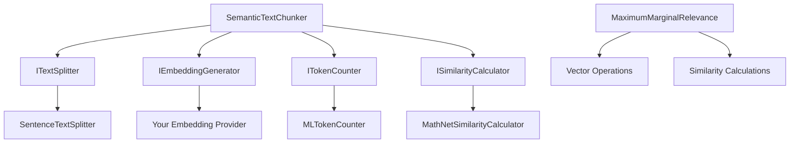

# AiGeekSquad.AIContext

[](https://ci.appveyor.com/project/colombod/aicontext)
[](https://www.nuget.org/packages/AiGeekSquad.AIContext/)
[](https://www.nuget.org/packages/AiGeekSquad.AIContext/)
[](https://opensource.org/licenses/MIT)

A comprehensive C# library for **AI-powered context management**, providing intelligent text processing capabilities for modern AI applications. This library combines **semantic text chunking** and **Maximum Marginal Relevance (MMR)** algorithms to help you build better RAG systems, search engines, and content recommendation platforms.

## 🏗️ Repository Structure

```
AiContext/
├── src/
│   ├── AiGeekSquad.AIContext/              # Main library package
│   │   ├── Chunking/                       # Semantic text chunking components
│   │   ├── Ranking/                        # MMR algorithm implementation
│   │   └── README.md                       # NuGet package documentation
│   ├── AiGeekSquad.AIContext.MEAI/         # Microsoft.Extensions.AI integration
│   ├── AiGeekSquad.AIContext.Tests/        # Unit tests
│   └── AiGeekSquad.AIContext.Benchmarks/   # Performance benchmarks
├── docs/                                   # Detailed documentation
├── examples/                               # Usage examples
└── README.md                               # This file (repository overview)
```

## ✨ Features

### 🧠 **Semantic Text Chunking**
- **Intelligent text splitting** based on semantic similarity analysis
- **Configurable chunk sizes** with token-aware boundaries
- **Multiple text splitters** (sentence, custom regex patterns)
- **Embedding-based analysis** using your choice of embedding providers
- **Fallback mechanisms** ensuring robust chunk generation

### 🎯 **Maximum Marginal Relevance (MMR)**
- **High-performance implementation** of the MMR algorithm
- **Relevance-diversity balance** for better search results
- **Optimized for large datasets** with O(n²k) complexity
- **Comprehensive benchmarks** with real performance data

### 🛠️ **Extensible Architecture**
- **Dependency injection ready** with clean interfaces
- **Custom text splitters** for domain-specific requirements
- **Pluggable embedding generators** for different AI models
- **Token counting** with real tokenizer implementations

## 🚀 Getting Started

### Prerequisites

- **.NET 9.0 SDK** or later
- **Visual Studio 2022** or **VS Code** with C# extension

### Building the Project

```bash
# Clone the repository
git clone https://github.com/AiGeekSquad/AIContext.git
cd AIContext

# Restore dependencies
dotnet restore

# Build the solution
dotnet build

# Build in Release mode
dotnet build --configuration Release
```

### Running Tests

```bash
# Run all tests
dotnet test

# Run tests with coverage
dotnet test --collect:"XPlat Code Coverage"

# Run specific test projects
dotnet test src/AiGeekSquad.AIContext.Tests/
dotnet test --filter "SemanticChunkingTests"
dotnet test --filter "MaximumMarginalRelevanceTests"
```

### Running Benchmarks

```bash
# Run all benchmarks
dotnet run --project src/AiGeekSquad.AIContext.Benchmarks/ --configuration Release

# Run specific benchmarks
dotnet run --project src/AiGeekSquad.AIContext.Benchmarks/ --configuration Release -- --filter "*MMR*"
dotnet run --project src/AiGeekSquad.AIContext.Benchmarks/ --configuration Release -- --filter "*Chunking*"
```

## 🧪 Testing

The library includes comprehensive test coverage:
- **44 unit tests** covering all core functionality
- **Real implementation testing** (no mocks for core algorithms)
- **Edge case handling** with robust fallback mechanisms
- **Performance testing** with benchmarks

### Test Categories

| Test Project | Coverage | Description |
|--------------|----------|-------------|
| `SemanticChunkingTests` | Core chunking logic | Text splitting, embedding analysis, chunk generation |
| `SentenceTextSplitterTests` | Text splitting | Sentence boundary detection, custom patterns |
| `MaximumMarginalRelevanceTests` | MMR algorithm | Relevance scoring, diversity optimization |

### Running Specific Test Categories

```bash
# Semantic chunking tests
dotnet test --filter "SemanticChunkingTests"

# Text splitter tests
dotnet test --filter "SentenceTextSplitterTests"

# MMR algorithm tests
dotnet test --filter "MaximumMarginalRelevanceTests"
```

## 📊 Performance Benchmarks

### Benchmark Results

The project includes comprehensive benchmarks in [`src/AiGeekSquad.AIContext.Benchmarks/`](src/AiGeekSquad.AIContext.Benchmarks/):

#### MMR Performance
- **1,000 vectors**: ~2ms processing time
- **Low memory allocation**: ~120KB per 1,000 vectors
- **Optimized for .NET 9.0** with AVX-512 support

#### Semantic Chunking Performance
- **Streaming processing** with `IAsyncEnumerable` for large documents
- **Memory efficient** with configurable embedding cache
- **Token-aware** using real tokenizers (Microsoft.ML.Tokenizers)

### Running Performance Analysis

```bash
# Run all benchmarks with detailed output
dotnet run --project src/AiGeekSquad.AIContext.Benchmarks/ --configuration Release

# Export results to different formats
dotnet run --project src/AiGeekSquad.AIContext.Benchmarks/ --configuration Release -- --exporters json
dotnet run --project src/AiGeekSquad.AIContext.Benchmarks/ --configuration Release -- --exporters html
```

## 🔧 Development Workflow

### Project Setup for Contributors

1. **Fork the repository** on GitHub
2. **Clone your fork** locally:
   ```bash
   git clone https://github.com/YOUR-USERNAME/AIContext.git
   cd AIContext
   ```
3. **Create a feature branch**:
   ```bash
   git checkout -b feature/your-feature-name
   ```
4. **Install dependencies**:
   ```bash
   dotnet restore
   ```
5. **Make your changes** and ensure tests pass:
   ```bash
   dotnet build
   dotnet test
   ```

### Code Quality Standards

- **Code Coverage**: Maintain >90% test coverage for new features
- **Performance**: Run benchmarks for performance-critical changes
- **Documentation**: Update relevant documentation for API changes
- **Coding Style**: Follow existing C# conventions and patterns

### Continuous Integration

The project uses **AppVeyor** for continuous integration:
- **Automated builds** on every commit
- **Test execution** across multiple .NET versions
- **NuGet package generation** for releases
- **Performance regression detection**

## 📋 Use Cases

### 🔍 **RAG Systems (Retrieval Augmented Generation)**
```csharp
// Chunk documents for vector storage
var chunks = await chunker.ChunkDocumentAsync(document, metadata);

// Later: retrieve and diversify context for LLM
var contextChunks = MaximumMarginalRelevance.ComputeMMR(
    vectors: candidateEmbeddings,
    query: queryEmbedding,
    lambda: 0.8,  // Prioritize relevance for accuracy
    topK: 5
);
```

### 📚 **Document Processing**
- **Knowledge base chunking** for semantic search
- **Legal document analysis** with custom text splitters
- **Research paper processing** with academic content patterns
- **Technical documentation** with code-aware splitting

### 🎯 **Content Recommendation**
- **Diverse article recommendations** using MMR
- **Product recommendation systems** with balanced results
- **Content curation** avoiding redundant information

## 🏗️ Architecture

### Core Components



### Core Interfaces

```csharp
// Implement for your embedding provider
public interface IEmbeddingGenerator
{
    IAsyncEnumerable<Vector<double>> GenerateBatchEmbeddingsAsync(
        IEnumerable<string> texts, 
        CancellationToken cancellationToken = default);
}

// Implement for custom text splitting
public interface ITextSplitter
{
    IAsyncEnumerable<TextSegment> SplitAsync(
        string text, 
        CancellationToken cancellationToken = default);
}

// Real token counting
public interface ITokenCounter
{
    Task<int> CountTokensAsync(string text, CancellationToken cancellationToken = default);
}
```

### Built-in Implementations

- **`MLTokenCounter`**: GPT-4 compatible tokenizer using Microsoft.ML.Tokenizers
- **`SentenceTextSplitter`**: Regex-based sentence splitting with customizable patterns
- **`MathNetSimilarityCalculator`**: Cosine similarity using MathNet.Numerics
- **`EmbeddingCache`**: LRU cache for embedding storage

## 📦 Dependencies

| Package | Version | Purpose |
|---------|---------|---------|
| **MathNet.Numerics** | v5.0.0 | Vector operations and similarity calculations |
| **Microsoft.ML.Tokenizers** | v0.22.0 | Real tokenization for accurate token counting |
| **.NET** | 9.0 | Target framework for optimal performance |

## 📖 Documentation

- **[MMR Algorithm](docs/MMR.md)**: Detailed MMR documentation with benchmarks
- **[Semantic Chunking](docs/SemanticChunking.md)**: In-depth chunking algorithm explanation
- **[API Reference](https://github.com/AiGeekSquad/AIContext/wiki/API-Reference)**: Complete API documentation
- **[Examples](examples/)**: Sample implementations and use cases

## 🤝 Contributing

We welcome contributions! Here's how to get involved:

### Types of Contributions

- **🐛 Bug Reports**: Submit detailed bug reports with reproduction steps
- **✨ Feature Requests**: Propose new features with use cases and examples
- **📝 Documentation**: Improve documentation, examples, and guides
- **🔧 Code Contributions**: Implement features, fix bugs, optimize performance

### Contribution Process

1. **Check existing issues** to avoid duplicates
2. **Create an issue** to discuss major changes
3. **Fork and create a branch** for your contribution
4. **Write tests** for new functionality
5. **Ensure all tests pass** and maintain code coverage
6. **Update documentation** as needed
7. **Submit a pull request** with clear description

### Development Guidelines

- Follow existing code style and patterns
- Write comprehensive tests for new features
- Update benchmarks for performance-critical changes
- Document public APIs with XML comments
- Keep commits focused and well-described

## 📄 License

This project is licensed under the MIT License - see the [LICENSE](LICENSE) file for details.

## 🌟 Support

- **Issues**: [GitHub Issues](https://github.com/AiGeekSquad/AIContext/issues)
- **Discussions**: [GitHub Discussions](https://github.com/AiGeekSquad/AIContext/discussions)
- **Documentation**: [Wiki](https://github.com/AiGeekSquad/AIContext/wiki)

## 🙏 Acknowledgments

- **Carbonell, J. and Goldstein, J. (1998)** - Original MMR algorithm
- **Microsoft** - ML.NET tokenizers for accurate token counting
- **MathNet.Numerics** - Excellent numerical computing library
- **Community contributors** - Thank you for your feedback and contributions

---

**Built with ❤️ for the AI community by AiGeekSquad**
