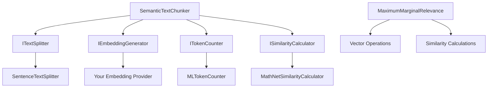

# AiGeekSquad.AIContext
[](https://ci.appveyor.com/project/colombod/aicontext)
[](https://www.nuget.org/packages/AiGeekSquad.AIContext/)
[](https://www.nuget.org/packages/AiGeekSquad.AIContext/)
[](https://opensource.org/licenses/MIT)


A comprehensive C# library for **AI-powered context management**, providing intelligent text processing capabilities for modern AI applications. This library combines **semantic text chunking** and **Maximum Marginal Relevance (MMR)** algorithms to help you build better RAG systems, search engines, and content recommendation platforms.

## 🏗️ Repository Structure

```
AiContext/
├── src/
│   ├── AiGeekSquad.AIContext/              # Main library package
│   │   ├── Chunking/                       # Semantic text chunking components
│   │   ├── Ranking/                        # MMR algorithm implementation
│   │   └── README.md                       # NuGet package documentation
│   ├── AiGeekSquad.AIContext.MEAI/         # Microsoft.Extensions.AI integration
│   ├── AiGeekSquad.AIContext.Tests/        # Unit tests
│   └── AiGeekSquad.AIContext.Benchmarks/   # Performance benchmarks
├── docs/                                   # Detailed documentation
├── examples/                               # Usage examples
└── README.md                               # This file (repository overview)
```

## ✨ Features

### 🧠 **Semantic Text Chunking**
- **Intelligent text splitting** based on semantic similarity analysis
- **Configurable chunk sizes** with token-aware boundaries
- **Multiple text splitters** (sentence, custom regex patterns)
- **Embedding-based analysis** using your choice of embedding providers
- **Fallback mechanisms** ensuring robust chunk generation

### 🎯 **Maximum Marginal Relevance (MMR)**
- **High-performance implementation** of the MMR algorithm
- **Relevance-diversity balance** for better search results
- **Optimized for large datasets** with O(n²k) complexity
- **Comprehensive benchmarks** with real performance data

### ⚖️ **Generic Ranking Engine**
- **Combines multiple scoring functions** with weights (positive for similarity, negative for dissimilarity)
- **Multiple normalization strategies** (MinMax, ZScore, Percentile) for score standardization
- **Multiple combination strategies** (WeightedSum, Reciprocal Rank Fusion, Hybrid) for flexible ranking
- **Extensible architecture** for custom scoring functions and strategies
- **Fully benchmarked** with performance insights and optimization guidance

### 🛠️ **Extensible Architecture**
- **Dependency injection ready** with clean interfaces
- **Custom text splitters** for domain-specific requirements
- **Pluggable embedding generators** for different AI models
- **Token counting** with real tokenizer implementations

## 🚀 Getting Started

### Prerequisites

- **.NET 9.0 SDK** or later
- **Visual Studio 2022** or **VS Code** with C# extension

### Building the Project

```bash
# Clone the repository
git clone https://github.com/AiGeekSquad/AIContext.git
cd AIContext

# Restore dependencies
dotnet restore

# Build the solution
dotnet build

# Build in Release mode
dotnet build --configuration Release
```

### Running Tests

```bash
# Run all tests
dotnet test

# Run tests with coverage
dotnet test --collect:"XPlat Code Coverage"

# Run specific test projects
dotnet test src/AiGeekSquad.AIContext.Tests/
dotnet test --filter "SemanticChunkingTests"
dotnet test --filter "MaximumMarginalRelevanceTests"
```

### Running Examples

```bash
# Run the basic chunking example
dotnet run --project examples/ --configuration Release BasicChunking

# Run the MMR demonstration
dotnet run --project examples/ --configuration Release MMR

# Or create a simple console app to test
dotnet new console -n MyAIContextTest
cd MyAIContextTest
dotnet add package AiGeekSquad.AIContext
# Copy examples from the repository and run
```

### Running Benchmarks

```bash
# Run all benchmarks
dotnet run --project src/AiGeekSquad.AIContext.Benchmarks/ --configuration Release

# Run specific benchmarks
dotnet run --project src/AiGeekSquad.AIContext.Benchmarks/ --configuration Release -- --filter "*MMR*"
dotnet run --project src/AiGeekSquad.AIContext.Benchmarks/ --configuration Release -- --filter "*Chunking*"

# Export benchmark results
dotnet run --project src/AiGeekSquad.AIContext.Benchmarks/ --configuration Release -- --exporters json html
```

## 🧪 Testing

The library includes comprehensive test coverage:

- **44 unit tests** covering all core functionality
- **Real implementation testing** (no mocks for core algorithms)
- **Edge case handling** with robust fallback mechanisms
- **Performance testing** with benchmarks

### Test Categories

| Test Project | Coverage | Description |
|--------------|----------|-------------|
| `SemanticChunkingTests` | Core chunking logic | Text splitting, embedding analysis, chunk generation |
| `SentenceTextSplitterTests` | Text splitting | Sentence boundary detection, custom patterns |
| `MaximumMarginalRelevanceTests` | MMR algorithm | Relevance scoring, diversity optimization |

### Running Specific Test Categories

```bash
# Semantic chunking tests
dotnet test --filter "SemanticChunkingTests"

# Text splitter tests
dotnet test --filter "SentenceTextSplitterTests"

# MMR algorithm tests
dotnet test --filter "MaximumMarginalRelevanceTests"
```

## 📊 Performance Benchmarks

The project includes comprehensive benchmarks in [`src/AiGeekSquad.AIContext.Benchmarks/`](src/AiGeekSquad.AIContext.Benchmarks/) using **BenchmarkDotNet** for accurate performance measurement.

### ⚖️ Generic Ranking Engine Benchmarks

The [`RankingEngineBenchmarks.cs`](src/AiGeekSquad.AIContext.Benchmarks/RankingEngineBenchmarks.cs) file provides comprehensive performance testing for the Generic Ranking Engine with multiple scoring functions, normalization strategies, and combination approaches.

### 🎯 MMR Algorithm Benchmarks

The [`MmrBenchmarks.cs`](src/AiGeekSquad.AIContext.Benchmarks/MmrBenchmarks.cs) file provides comprehensive performance testing for the Maximum Marginal Relevance algorithm.

#### Benchmark Parameters

| Parameter | Values Tested | Description |
|-----------|---------------|-------------|
| **Vector Count** | 1,000 | Number of vectors in the dataset |
| **Vector Dimensions** | 100, 384 | Embedding dimensions (standard and OpenAI-compatible) |
| **TopK** | 10 | Number of results to return |
| **Lambda** | 0.0, 0.5, 1.0 | Relevance vs diversity balance |

#### MMR Benchmark Scenarios

| Benchmark Method | Purpose | Configuration |
|------------------|---------|---------------|
| `ComputeMMR()` | **Main benchmark** with parameter combinations | Uses `[Params]` for comprehensive testing |
| `ComputeMMR_PureRelevance()` | Pure relevance selection | Lambda = 1.0 (relevance only) |
| `ComputeMMR_PureDiversity()` | Pure diversity selection | Lambda = 0.0 (diversity only) |
| `ComputeMMR_Balanced()` | Balanced selection | Lambda = 0.5 (balanced approach) |
| `ComputeMMR_MemoryFocused()` | Memory allocation analysis | Includes forced GC for accurate measurement |

#### Performance Characteristics

- **Processing Time**: ~2ms for 1,000 vectors (384 dimensions)
- **Memory Allocation**: ~120KB per 1,000 vectors
- **Complexity**: O(n²k) where n = vector count, k = topK
- **Optimization**: Leverages .NET 9.0 with AVX-512 support
- **Reproducibility**: Fixed seed (42) for consistent results

### 🧠 Semantic Chunking Benchmarks

The [`SemanticChunkingBenchmarks.cs`](src/AiGeekSquad.AIContext.Benchmarks/SemanticChunkingBenchmarks.cs) file provides comprehensive performance testing for semantic text chunking functionality.

#### Benchmark Parameters

| Parameter | Values Tested | Description |
|-----------|---------------|-------------|
| **Document Size** | Short, Medium, Long | Text complexity and length variations |
| **Max Tokens Per Chunk** | 256, 512 | Chunk size configurations |
| **Caching** | Enabled, Disabled | Embedding cache impact |

#### Document Size Specifications

| Size | Content | Token Count (Approx.) |
|------|---------|----------------------|
| **Short** | 5 simple sentences | ~50-100 tokens |
| **Medium** | 3 paragraphs with technical content | ~200-400 tokens |
| **Long** | 3 detailed paragraphs with complex topics | ~800-1200 tokens |

#### Semantic Chunking Benchmark Scenarios

| Benchmark Method | Purpose | Configuration |
|------------------|---------|---------------|
| `SemanticChunking_Complete()` | **Baseline benchmark** | Uses parameterized configurations |
| `SemanticChunking_DefaultOptions()` | Default configuration performance | Standard `SemanticChunkingOptions.Default` |
| `SemanticChunking_OptimizedForSpeed()` | Speed-optimized configuration | Buffer=1, Threshold=0.75, Cache=true |
| `SemanticChunking_OptimizedForQuality()` | Quality-optimized configuration | Buffer=3, Threshold=0.90, MaxTokens=1024 |
| `SemanticChunking_SmallBuffer()` | Buffer size impact (small) | BufferSize=1 |
| `SemanticChunking_LargeBuffer()` | Buffer size impact (large) | BufferSize=4 |
| `SemanticChunking_CachingFirstPass()` | Cache miss performance | Fresh chunker instance |
| `SemanticChunking_NoCaching()` | No caching baseline | Caching disabled |

#### Performance Characteristics

- **Streaming Processing**: Uses `IAsyncEnumerable` for memory efficiency
- **Token-Aware**: Real tokenization using Microsoft.ML.Tokenizers
- **Embedding Cache**: LRU cache with configurable size (up to 1000 entries)
- **Mock Implementation**: High-performance mocks for consistent benchmarking
- **Memory Efficient**: Minimal allocations with streaming approach

### ⚙️ Benchmark Configuration

The benchmarks use a custom [`BenchmarkConfig.cs`](src/AiGeekSquad.AIContext.Benchmarks/BenchmarkConfig.cs) with the following settings:

#### Runtime Configuration

| Setting | Value | Purpose |
|---------|-------|---------|
| **Target Framework** | .NET 9.0 | Latest performance optimizations |
| **Platform** | x64 | 64-bit architecture support |
| **GC Modes** | Server GC, Workstation GC | Compare garbage collection strategies |
| **Memory Diagnostics** | Enabled | Track allocations and memory usage |

#### Output Formats

- **Console**: Real-time progress and summary
- **Markdown**: GitHub-compatible tables
- **HTML**: Interactive web reports
- **Statistical Analysis**: Mean, Median, P95, Rankings

### 🚀 Running Benchmarks

#### Command Line Options

```bash
# Run MMR benchmarks only
dotnet run --project src/AiGeekSquad.AIContext.Benchmarks/ --configuration Release mmr

# Run semantic chunking benchmarks only
dotnet run --project src/AiGeekSquad.AIContext.Benchmarks/ --configuration Release semantic

# Run all benchmarks
dotnet run --project src/AiGeekSquad.AIContext.Benchmarks/ --configuration Release all

# Run with specific filters
dotnet run --project src/AiGeekSquad.AIContext.Benchmarks/ --configuration Release -- --filter "*MMR*"
dotnet run --project src/AiGeekSquad.AIContext.Benchmarks/ --configuration Release -- --filter "*Chunking*"
```

#### Export Options

```bash
# Export to JSON format
dotnet run --project src/AiGeekSquad.AIContext.Benchmarks/ --configuration Release -- --exporters json

# Export to HTML format
dotnet run --project src/AiGeekSquad.AIContext.Benchmarks/ --configuration Release -- --exporters html

# Export to multiple formats
dotnet run --project src/AiGeekSquad.AIContext.Benchmarks/ --configuration Release -- --exporters json html
```

### 📈 Benchmark Environment

#### Hardware Requirements

- **OS**: Windows (for Windows-specific performance counters)
- **Runtime**: .NET 9.0 SDK
- **Architecture**: x64 recommended for optimal performance
- **Memory**: Sufficient RAM for vector operations and caching

#### Test Data Generation

- **Reproducible**: Fixed seed (42) for consistent results
- **Realistic**: Vector values between -1 and 1
- **Fresh Data**: Regenerated per iteration to avoid caching effects
- **Normalized**: Proper vector normalization for semantic similarity

### 🔍 Performance Insights

The benchmarks help identify:

- **Scalability**: How performance scales with vector count and dimensions
- **Memory Usage**: Allocation patterns and memory efficiency
- **Parameter Impact**: How lambda and TopK values affect MMR performance
- **Configuration Impact**: How chunking options affect semantic processing
- **Caching Benefits**: Performance gains from embedding caching
- **GC Behavior**: Impact of different garbage collection strategies

## 🔧 Development Workflow

### Project Setup for Contributors

1. **Fork the repository** on GitHub
2. **Clone your fork** locally:
   ```bash
   git clone https://github.com/YOUR-USERNAME/AIContext.git
   cd AIContext
   ```
3. **Create a feature branch**:
   ```bash
   git checkout -b feature/your-feature-name
   ```
4. **Install dependencies**:
   ```bash
   dotnet restore
   ```
5. **Make your changes** and ensure tests pass:
   ```bash
   dotnet build
   dotnet test
   ```

### Code Quality Standards

- **Code Coverage**: Maintain >90% test coverage for new features
- **Performance**: Run benchmarks for performance-critical changes
- **Documentation**: Update relevant documentation for API changes
- **Coding Style**: Follow existing C# conventions and patterns

### Continuous Integration

The project uses **AppVeyor** for continuous integration:
- **Automated builds** on every commit
- **Test execution** across multiple .NET versions
- **NuGet package generation** for releases
- **Performance regression detection**

## 💡 Examples & Use Cases

### 🚀 **Complete Working Examples**

The [`examples/`](examples/) directory contains fully functional demonstrations:

- **[`BasicChunking.cs`](examples/BasicChunking.cs)** - Complete semantic chunking example with sample embedding generator
- **[`MMRExample.cs`](examples/MMRExample.cs)** - MMR algorithm demonstration with different lambda values and RAG system context

### 🔍 **RAG Systems (Retrieval Augmented Generation)**
```csharp
// Complete RAG pipeline example
public async Task<string> ProcessUserQuery(string question)
{
    // 1. Generate query embedding
    var queryEmbedding = await embeddingGenerator.GenerateEmbeddingAsync(question);
    
    // 2. Retrieve candidate chunks from vector database
    var candidates = await vectorDb.SearchSimilarAsync(queryEmbedding, topK: 20);
    
    // 3. Use MMR to select diverse, relevant context
    var selectedContext = MaximumMarginalRelevance.ComputeMMR(
        vectors: candidates.Select(c => c.Embedding).ToList(),
        query: queryEmbedding,
        lambda: 0.8,  // Balance relevance vs diversity
        topK: 5       // Limit for LLM context window
    );
    
    // 4. Generate response with selected context
    var contextText = string.Join("\n", selectedContext.Select(s => candidates[s.Index].Text));
    return await llm.GenerateResponseAsync(question, contextText);
}
```

### 📚 **Document Processing Scenarios**

- **Knowledge base chunking** - Semantic splitting for enterprise search systems
- **Legal document analysis** - Custom text splitters for numbered sections and clauses
- **Research paper processing** - Academic content patterns with citation awareness
- **Technical documentation** - Code-aware splitting that preserves syntax integrity

### 🎯 **Content Recommendation Systems**
```csharp
// Avoid recommending similar content using MMR
var recommendations = MaximumMarginalRelevance.ComputeMMR(
    vectors: availableContent.Select(c => c.Embedding).ToList(),
    query: userInterestVector,
    lambda: 0.6,  // Favor diversity for better user experience
    topK: 10
);
```

### 🔬 **Research & Analytics Applications**

- **Literature review systems** - Diverse paper selection for comprehensive coverage
- **Market research** - Balanced sampling from different data sources
- **Content analysis** - Representative text selection for qualitative research

### ⚖️ **Generic Ranking Engine for Multi-Criteria Ranking**
```csharp
using System;
using System.Collections.Generic;
using System.Linq;
using AiGeekSquad.AIContext.Ranking;
using AiGeekSquad.AIContext.Ranking.Normalizers;
using AiGeekSquad.AIContext.Ranking.Strategies;

// Example document class
public class Document
{
    public string Title { get; set; }
    public double RelevanceScore { get; set; }
    public int PopularityRank { get; set; }
    
    public Document(string title, double relevanceScore, int popularityRank)
    {
        Title = title;
        RelevanceScore = relevanceScore;
        PopularityRank = popularityRank;
    }
}

// Custom scoring functions
public class SemanticRelevanceScorer : IScoringFunction<Document>
{
    public string Name => "SemanticRelevance";
    public double ComputeScore(Document item) => item.RelevanceScore;
    public double[] ComputeScores(IReadOnlyList<Document> items) =>
        items.Select(ComputeScore).ToArray();
}

public class PopularityScorer : IScoringFunction<Document>
{
    public string Name => "Popularity";
    public double ComputeScore(Document item) => 1.0 / item.PopularityRank;
    public double[] ComputeScores(IReadOnlyList<Document> items) =>
        items.Select(ComputeScore).ToArray();
}

// Create documents to rank
var documents = new List<Document>
{
    new("AI Research Paper", relevanceScore: 0.9, popularityRank: 5),
    new("ML Tutorial", relevanceScore: 0.7, popularityRank: 1),
    new("Data Science Guide", relevanceScore: 0.8, popularityRank: 3)
};

// Create scoring functions with weights
var scoringFunctions = new List<WeightedScoringFunction<Document>>
{
    // Positive weight for similarity (relevance)
    new(new SemanticRelevanceScorer(), weight: 0.7)
    {
        Normalizer = new MinMaxNormalizer()
    },
    // Negative weight for dissimilarity (avoid popular but less relevant)
    new(new PopularityScorer(), weight: -0.3)
    {
        Normalizer = new ZScoreNormalizer()
    }
};

// Create ranking engine and rank documents
var engine = new RankingEngine<Document>();
var results = engine.Rank(documents, scoringFunctions, new WeightedSumStrategy());

foreach (var result in results)
{
    Console.WriteLine($"Rank {result.Rank}: {result.Item.Title} (Score: {result.FinalScore:F3})");
    Console.WriteLine($"  Relevance: {result.ComponentScores["SemanticRelevance"]:F3}");
    Console.WriteLine($"  Popularity: {result.ComponentScores["Popularity"]:F3}");
}
```

## 🏗️ Architecture

### Core Components



### Core Interfaces

```csharp
// Implement for your embedding provider
public interface IEmbeddingGenerator
{
    IAsyncEnumerable<Vector<double>> GenerateBatchEmbeddingsAsync(
        IEnumerable<string> texts, 
        CancellationToken cancellationToken = default);
}

// Implement for custom text splitting
public interface ITextSplitter
{
    IAsyncEnumerable<TextSegment> SplitAsync(
        string text, 
        CancellationToken cancellationToken = default);
}

// Real token counting
public interface ITokenCounter
{
    Task<int> CountTokensAsync(string text, CancellationToken cancellationToken = default);
}
```

### Built-in Implementations

- **[`MLTokenCounter`](src/AiGeekSquad.AIContext/Chunking/MLTokenCounter.cs)** - GPT-4 compatible tokenizer using Microsoft.ML.Tokenizers
- **[`SentenceTextSplitter`](src/AiGeekSquad.AIContext/Chunking/SentenceTextSplitter.cs)** - Regex-based sentence splitting with customizable patterns
  - Default pattern is optimized for English text
  - Handles common English titles and abbreviations (Mr., Mrs., Ms., Dr., Prof., Sr., Jr.)
  - Prevents incorrect sentence breaks at abbreviations
- **[`MathNetSimilarityCalculator`](src/AiGeekSquad.AIContext/Chunking/MathNetSimilarityCalculator.cs)** - Cosine similarity using MathNet.Numerics
- **[`EmbeddingCache`](src/AiGeekSquad.AIContext/Chunking/EmbeddingCache.cs)** - LRU cache for embedding storage

## 📦 Dependencies

| Package | Version | Purpose |
|---------|---------|---------|
| **MathNet.Numerics** | v5.0.0 | Vector operations and similarity calculations |
| **Microsoft.ML.Tokenizers** | v0.22.0 | Real tokenization for accurate token counting |
| **.NET** | 9.0 | Target framework for optimal performance |

## 📖 Documentation

- **[MMR Algorithm](docs/MMR.md)** - Detailed MMR documentation with benchmarks
- **[Semantic Chunking](docs/SemanticChunking.md)** - In-depth chunking algorithm explanation
- **[API Reference](https://github.com/AiGeekSquad/AIContext/wiki/API-Reference)** - Complete API documentation
- **[Examples](examples/)** - Sample implementations and use cases

## 🤝 Contributing

We welcome contributions! Here's how to get involved:

### Types of Contributions

- **🐛 Bug Reports** - Submit detailed bug reports with reproduction steps
- **✨ Feature Requests** - Propose new features with use cases and examples
- **📝 Documentation** - Improve documentation, examples, and guides
- **🔧 Code Contributions** - Implement features, fix bugs, optimize performance

### Contribution Process

1. **Check existing issues** to avoid duplicates
2. **Create an issue** to discuss major changes
3. **Fork and create a branch** for your contribution
4. **Write tests** for new functionality
5. **Ensure all tests pass** and maintain code coverage
6. **Update documentation** as needed
7. **Submit a pull request** with clear description

### Development Guidelines

- Follow existing code style and patterns
- Write comprehensive tests for new features
- Update benchmarks for performance-critical changes
- Document public APIs with XML comments
- Keep commits focused and well-described

## 📄 License

This project is licensed under the MIT License - see the [LICENSE](LICENSE) file for details.

## 🌟 Support

- **Issues** - [GitHub Issues](https://github.com/AiGeekSquad/AIContext/issues)
- **Discussions** - [GitHub Discussions](https://github.com/AiGeekSquad/AIContext/discussions)
- **Documentation** - [Wiki](https://github.com/AiGeekSquad/AIContext/wiki)

## 🙏 Acknowledgments

- **Carbonell, J. and Goldstein, J. (1998)** - Original MMR algorithm
- **Microsoft** - ML.NET tokenizers for accurate token counting
- **MathNet.Numerics** - Excellent numerical computing library
- **Community contributors** - Thank you for your feedback and contributions

---

**Built with ❤️ for the AI community by AiGeekSquad**
