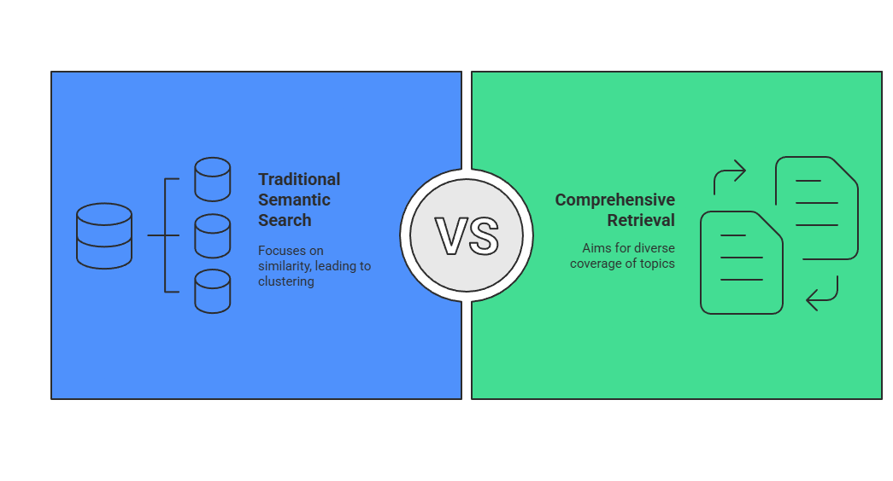

# Beyond Basic RAG: How Maximum Marginal Relevance Transforms Your .NET Applications

*Taking RAG systems from good to great with intelligent context selection*

Your AI assistant just told a user to "restart the service" three times in a row, using slightly different words each time. Meanwhile, the specific configuration changes they actually needed never made it into the response.

If you've built a RAG system, you've seen this. Your vector search finds the most relevant documents, but they all say the same thing. You get repetitive information instead of comprehensive answers.

This post covers **Maximum Marginal Relevance (MMR)** - a technique that solves this problem by balancing relevance with diversity. We'll explore why it matters, how it works, and how to implement it effectively in .NET applications.

## The Context Selection Problem

RAG systems face a fundamental constraint: language models have limited context windows. When you can only include a few documents, each one needs to add unique value. If three of your five documents say the same thing, you're wasting 60% of your context space.

### What Goes Wrong

Poor context selection creates cascading problems that directly impact user experience:

- **Generic answers instead of specific solutions**: Users get broad overviews when they need actionable steps
- **Important information gets left out**: Critical details are excluded in favor of repetitive content  
- **Users receive contradictory advice**: Conflicting information from similar sources confuses rather than clarifies
- **Higher follow-up question rates**: Incomplete answers force users to ask multiple questions
- **Reduced user trust**: Inconsistent or unhelpful responses erode confidence in the system

**Real-world examples where this hurts:**
- A medical information system mixing Type 1 and Type 2 diabetes treatment protocols in the same response
- A legal research tool combining precedents from different jurisdictions without clear distinction
- A customer support system showing account upgrade information when someone explicitly wants to cancel their subscription

These aren't edge cases: they're predictable outcomes when relevance-only selection meets the clustering nature of semantic search.

## Why Semantic Search Falls Short

Traditional RAG uses semantic search to find the most relevant documents. This approach prioritizes similarity scores above all else, which creates a clustering problem: highly similar documents often cluster around the same topics, leading to redundant information in your context. Understanding this limitation is crucial because it directly impacts the quality and usefulness of your AI system's responses.



Consider a customer searching for "wireless headphones" on an e-commerce site. Semantic similarity will surface the most relevant products, but they might all be premium over-ear headphones, missing the wireless earbuds, charging accessories, or protective cases that complete the customer's actual shopping journey.

Here's this clustering problem in action:

```csharp
// E-commerce search demonstrating the clustering problem
var products = new[]
{
    new { Name = "Sony WH-1000XM4 Wireless Headphones", Similarity = 0.95, Category = "Audio" },
    new { Name = "Bose QuietComfort Wireless Headphones", Similarity = 0.93, Category = "Audio" },
    new { Name = "Apple AirPods Pro Wireless Earbuds", Similarity = 0.91, Category = "Audio" },
    new { Name = "Wireless Phone Charger", Similarity = 0.45, Category = "Accessories" },
    new { Name = "Bluetooth Speaker", Similarity = 0.42, Category = "Audio" },
    new { Name = "USB-C Cable", Similarity = 0.15, Category = "Accessories" }
};

Console.WriteLine("Query: 'wireless headphones'");
Console.WriteLine("\nTraditional search (top 3 most similar):");

var traditionalResults = products
    .OrderByDescending(p => p.Similarity)
    .Take(3);
    
foreach (var product in traditionalResults)
{
    Console.WriteLine($"• {product.Name} (similarity: {product.Similarity})");
}

var uniqueCategories = traditionalResults.Select(p => p.Category).Distinct().Count();
Console.WriteLine($"\nProblem: Only {uniqueCategories} category represented - missing accessories!");
```

Traditional search returns three similar headphones but misses complementary accessories customers often need. The algorithm prioritizes similarity over usefulness, creating an incomplete shopping experience.

## Maximum Marginal Relevance Explained

MMR solves the clustering problem by balancing two competing goals: 

1. **Relevance** - How well does a document match your query?
2. **Diversity** - How different is it from documents you've already selected?

This balance is essential because pure relevance often leads to repetitive information, while pure diversity might miss your actual question.

### The Formula

```
MMR Score = λ × Relevance + (1-λ) × Diversity
```

Think of MMR like assembling a project team for a complex software initiative. You need people relevant to the project (developers, architects), but you don't want five people with identical skills. You want the core expertise plus complementary perspectives: a project manager, a UX designer, a DevOps engineer. Each team member should add unique value while still contributing to the overall goal.

The `λ` (lambda) parameter controls this balance. Choosing the right lambda value matters because it directly affects whether users get comprehensive answers or repetitive information:

- **λ = 1.0**: Pure relevance (traditional search) - gives you the most similar results
- **λ = 0.7**: Mostly relevance with some variety (recommended starting point) - covers your main topic plus related information
- **λ = 0.5**: Equal balance - broader coverage of the problem space
- **λ = 0.0**: Pure diversity - maximum variety, but might miss your actual question

**Practical example:** Query "API authentication issues"
- λ = 1.0: Three documents about JWT token validation (repetitive)
- λ = 0.7: JWT validation, OAuth setup, API key management (comprehensive)

Start with λ = 0.7 for most applications. This value prevents the "echo chamber" effect where all results say the same thing, while still answering your specific question.

## MMR in Practice

### Setup

Create a console app and add the required NuGet packages:

```bash
dotnet add package AiGeekSquad.AIContext
dotnet add package AiGeekSquad.AIContext.MEAI
dotnet add packkage OllamaSharp
dotnet add package Microsoft.Extensions.AI
dotnet add package MathNet.Numerics
```

For convenience, we've included in the [`AiGeekSquad.AIContext`](https://www.nuget.org/packages/AiGeekSquad.AIContext) a reference implementations of MMR and semantic chunking algorithms. This allows you to focus on the application of MMR rather than the implementation details. 

### Basic MMR Implementation

Here's how MMR transforms a customer support scenario:

```csharp
using Microsoft.Extensions.AI;
using AiGeekSquad.AIContext.Ranking;
using MathNet.Numerics.LinearAlgebra;
using MathNet.Numerics;

// Set up embedding generator (using Ollama for local development)
IEmbeddingGenerator<string,Embedding<float>> embeddingGenerator =
    new OllamaApiClient("http://localhost:11434", "all-minilm");

// Customer support solutions for "app crashes on startup"
var solutionTexts = new[]
{
    "Clear app cache and data to resolve startup issues",
    "Restart the application to fix temporary glitches",
    "Reinstall the app to fix corrupted installation",
    "Check system requirements and compatibility",
    "Update device drivers for hardware compatibility",
    "Contact technical support for advanced troubleshooting"
};

// Generate embeddings and apply MMR
var solutionEmbeddings = new List<(string solution, Vector<double> embedding)>();
foreach (var solution in solutionTexts)
{
    var embeddingResult = await embeddingGenerator.GenerateVectorAsync(solution);
    var embedding = Vector<double>.Build.DenseOfArray(
        embeddingResult.ToArray().Select(f => (double)f).ToArray());
    solutionEmbeddings.Add((solution, embedding));
}

var queryText = "app crashes on startup";
var queryEmbeddingResult = await embeddingGenerator.GenerateVectorAsync(queryText);
var queryEmbedding = Vector<double>.Build.DenseOfArray(
    queryEmbeddingResult.ToArray().Select(f => (double)f).ToArray());

// Compare traditional vs MMR results
var mmrResults = MaximumMarginalRelevance.ComputeMMR(
    vectors: solutionEmbeddings.Select(s => s.embedding).ToList(),
    query: queryEmbedding,
    lambda: 0.7,
    topK: 3
);

foreach (var (index, score) in mmrResults)
{
    var solution = solutionEmbeddings[index].solution;
    Console.WriteLine($"• {solution}");
}
```

Instead of three variations of "restart/reinstall/clear cache," MMR selects solutions from different troubleshooting categories: basic fixes, system compatibility, and escalation paths.

## Choosing Lambda Values

The lambda parameter is crucial for getting the right balance. Choosing the optimal lambda value matters because it directly impacts user satisfaction and task completion rates. Different domains and query types benefit from different approaches:

| Lambda | Balance | Best For |
|:------:|:--------|:---------|
| **0.9** | High relevance | FAQ systems, troubleshooting |
| **0.7** | Balanced (recommended) | General-purpose RAG |
| **0.5** | Equal balance | Research, comparative analysis |
| **0.3** | High diversity | Content discovery, brainstorming |

**Domain-specific recommendations:**
- **Customer Support**: λ = 0.8 (accuracy matters more than exploration because incorrect solutions frustrate users)
- **Research Tools**: λ = 0.6 (diverse perspectives help build understanding and reveal knowledge gaps)
- **Content Discovery**: λ = 0.4 (exploration is the goal, not precision)
- **Technical Documentation**: λ = 0.8 (precision is critical for implementation success)

### Adaptive Lambda Selection

Production systems benefit from dynamic lambda selection based on query characteristics:

```csharp
private double GetOptimalLambda(string question, string domain)
{
    var questionLower = question.ToLowerInvariant();
    
    // Query-based selection
    if (questionLower.Contains("how to") || questionLower.Contains("steps"))
        return 0.8; // Precision for procedures
        
    if (questionLower.Contains("compare") || questionLower.Contains("different"))
        return 0.5; // Diversity for comparisons
        
    // Domain-based defaults
    return domain.ToLowerInvariant() switch
    {
        "support" => 0.8,
        "research" => 0.6,
        "legal" => 0.9,
        "technical" => 0.75,
        _ => 0.7
    };
}
```

## Production Implementation Patterns

Real-world MMR implementations can benefit from several key patterns for scalability and performance.

### Two-Stage Retrieval Pattern

The most important production pattern combines broad retrieval with MMR selection. This pattern is crucial because it maintains MMR's diversity benefits while keeping computational costs manageable:

1. **Stage 1**: Cast wide net - retrieve many candidates (25-100)
2. **Stage 2**: Apply MMR - select diverse subset (5-10)

This approach gives you MMR's benefits without comparing every document in your database:

```csharp
// Stage 1: Broad candidate retrieval
var candidates = await RetrieveCandidatesAsync(queryVector, limit: 25);

// Stage 2: MMR selection for diversity
var selectedDocs = MaximumMarginalRelevance.ComputeMMR(
    vectors: candidates.Select(c => c.Embedding).ToList(),
    query: queryVector,
    lambda: 0.7,
    topK: 5
);
```

### Caching Strategy

MMR computations are deterministic, making them excellent candidates for caching. Caching is particularly important for MMR because the diversity calculations are computationally expensive:

```csharp
var cacheKey = $"{domain}:{question.GetHashCode():X}:{lambda:F1}";
if (_cache.TryGetValue(cacheKey, out var cachedResponse))
{
    return cachedResponse;
}
```

**💡 Complete Implementation:** The notebook [`beyond-basic-rag-mmr-complete-demo.ipynb`](../examples/notebooks/beyond-basic-rag-mmr-complete-demo.ipynb) contains a full sample for you to look at. 

## Beyond RAG: Other Use Cases

MMR's relevance-diversity balance improves many AI applications beyond traditional document retrieval:

### E-commerce Recommendations

```csharp
var recommendations = MaximumMarginalRelevance.ComputeMMR(
    vectors: productEmbeddings,
    query: userPreferenceVector,
    lambda: 0.4,  // Favor discovery
    topK: 10
);
```
Instead of 10 similar smartphones, users get phones, cases, chargers, and accessories that form a complete ecosystem serving their actual needs.

### Content Curation

```csharp
var curatedArticles = MaximumMarginalRelevance.ComputeMMR(
    vectors: articleEmbeddings,
    query: topicVector,
    lambda: 0.3,  // High diversity
    topK: 5
);
```

A tech newsletter about "AI developments" covers language models, computer vision, robotics, ethics, and applications instead of 5 ChatGPT articles.

### Research Discovery

```csharp
var diversePapers = MaximumMarginalRelevance.ComputeMMR(
    vectors: paperEmbeddings,
    query: researchQuery,
    lambda: 0.6,
    topK: 15
);
```

"Machine learning optimization" returns papers on different techniques, domains, and evaluation metrics, providing comprehensive coverage of the field.

## Measuring Success

Track both technical and user experience metrics to validate MMR's impact:

**Technical Metrics:**
- Unique topics in selected documents
- Average similarity between selections (lower = more diverse)
- Document category representation
- Query processing latency

**User Experience Metrics:**
- Task completion rates
- Follow-up question frequency
- User satisfaction ratings
- Session engagement duration

**A/B Testing Approach:**
1. Split traffic 50/50 between traditional and MMR retrieval
2. Compare metrics over a period of time
3. Test different lambda values with smaller user segments
4. Survey users directly about answer quality and completeness

## Implementation Best Practices

**Start Simple:**
- Begin with λ = 0.7 for general applications
- Replace one retrieval call initially to minimize risk
- Measure baseline metrics before expanding

**Monitor What Matters:**
- User satisfaction and task completion rates
- Topic diversity in responses (aim for 2-3 distinct themes per response)
- Follow-up question rates (should decrease with better diversity)

**Scale Thoughtfully:**
- Implement caching early (MMR computations are deterministic)
- Use two-stage filtering for large document sets
- Document optimal lambda values for your specific use cases
- Monitor performance impact and adjust accordingly

## Advanced Techniques

Once you've mastered basic MMR, these patterns take it further. These advanced techniques matter because they address specific challenges that emerge in complex production environments:

### Semantic Chunking + MMR

Break documents intelligently, then apply MMR for optimal diversity. This combination is powerful because it ensures both meaningful document boundaries and diverse content selection:

```csharp
var chunks = await _semanticChunker.ChunkDocumentAsync(document);
var selectedChunks = MaximumMarginalRelevance.ComputeMMR(
    vectors: chunks.Select(c => c.Embedding).ToList(),
    query: queryEmbedding,
    lambda: 0.6,
    topK: 8
);
```

### Multi-Vector Retrieval + MMR

Use specialized embeddings for different content types. This approach is valuable because different content types (text, code, images) require different embedding strategies for optimal relevance:

```csharp
var textResults = await SearchTextEmbeddings(query);
var codeResults = await SearchCodeEmbeddings(query);
var combinedResults = textResults.Concat(codeResults);

var diverseSelection = MaximumMarginalRelevance.ComputeMMR(
    vectors: combinedResults.Select(r => r.Embedding).ToList(),
    query: queryEmbedding,
    lambda: 0.7,
    topK: 5
);
```

## Your Next Steps

The difference between a good RAG system and a great one often comes down to context selection. MMR solves the clustering problem that wastes your precious context window on repetitive information, transforming user experiences from frustrating to genuinely helpful. 

Ready to upgrade your RAG system? 

Start with the [`beyond-basic-rag-mmr-complete-demo.ipynb`](../examples/notebooks/beyond-basic-rag-mmr-complete-demo.ipynb) notebook to get familiar with the concepts and then try and implement in your existing RAG pipelines.