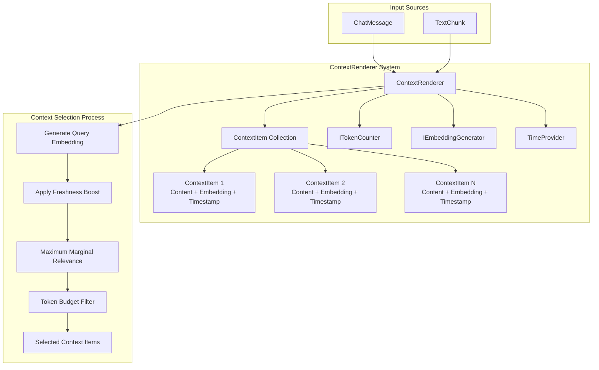

# Context Rendering

A comprehensive guide to the ContextRenderer feature for AI conversation management with Maximum Marginal Relevance (MMR), time-based freshness weighting, and memory-efficient context selection.

## Table of Contents

- [Overview](#overview)
- [Architecture & Design](#architecture--design)
- [API Documentation](#api-documentation)
- [Usage Examples](#usage-examples)
- [Configuration & Options](#configuration--options)
- [Testing Patterns](#testing-patterns)
- [Performance Considerations](#performance-considerations)
- [Integration Examples](#integration-examples)
- [Best Practices](#best-practices)
- [Troubleshooting](#troubleshooting)

## Overview

### What is ContextRenderer?

The [`ContextRenderer`](../src/AiGeekSquad.AIContext/ContextRendering/ContextRenderer.cs:18) is a sophisticated context management system designed for AI conversation systems. It intelligently selects and orders context items (chat messages, document chunks, or any textual content) using a combination of:

- **Semantic Similarity**: Using vector embeddings to find contextually relevant content
- **Maximum Marginal Relevance (MMR)**: Balancing relevance vs diversity to avoid redundant context
- **Time-based Freshness Weighting**: Prioritizing recent content when appropriate
- **Token Budget Management**: Efficiently managing context size within LLM token limits
- **Memory-Efficient Operations**: Streaming and efficient item management for large datasets

### Key Concepts

- **Context Items**: Individual pieces of content (messages/chunks) with embeddings and timestamps
- **Freshness Weighting**: Recent items get their embeddings adjusted to be more similar to the query
- **Lambda Parameter**: Controls MMR relevance vs diversity trade-off (0.0 = pure diversity, 1.0 = pure relevance)
- **Token Budget**: Maximum number of tokens to include in rendered context
- **TimeProvider Integration**: Testable time operations for deterministic behavior

### AIContext Library Ecosystem

ContextRenderer integrates seamlessly with other AIContext components:

- **[SemanticTextChunker](SemanticChunking.md)**: For breaking documents into semantically coherent chunks
- **[Maximum Marginal Relevance](MMR.md)**: Core algorithm for relevance/diversity balancing
- **[IEmbeddingGenerator](../src/AiGeekSquad.AIContext/Chunking/IEmbeddingGenerator.cs)**: Interface for embedding generation
- **[ITokenCounter](../src/AiGeekSquad.AIContext/Chunking/ITokenCounter.cs)**: Interface for token counting
- **Microsoft.Extensions.AI**: Native ChatMessage support for modern AI frameworks

## Architecture & Design

### Core Components



### ContextItem Structure

The [`ContextItem`](../src/AiGeekSquad.AIContext/ContextRendering/ContextItem.cs:9) represents a single piece of context with complete metadata:

```csharp
public class ContextItem
{
    public string Content { get; }           // Text content
    public Vector<double> Embedding { get; }  // Vector representation
    public int TokenCount { get; }           // Token count for budget management
    public DateTimeOffset Timestamp { get; } // When item was added
}
```

### TimeProvider Pattern

ContextRenderer uses the modern [`TimeProvider`](../src/AiGeekSquad.AIContext/ContextRendering/ContextRenderer.cs:32) pattern for testable time-dependent operations:

- **Production**: Uses `TimeProvider.System` for actual system time
- **Testing**: Uses `FakeTimeProvider` for deterministic time control
- **Benefits**: Eliminates slow, unreliable tests and enables precise time-based testing

### Memory-Efficient Design

- **In-Memory Collection**: Maintains `List<ContextItem>` for fast access and manipulation
- **Lazy Evaluation**: Freshness calculations only when needed
- **Efficient Filtering**: Token budget applied after MMR selection to minimize waste
- **Vector Operations**: Uses MathNet.Numerics for optimized mathematical operations

## API Documentation

### Constructor

```csharp
public ContextRenderer(
    ITokenCounter tokenCounter, 
    IEmbeddingGenerator embeddingGenerator, 
    TimeProvider? timeProvider = null)
```

| Parameter | Type | Description |
|-----------|------|-------------|
| `tokenCounter` | [`ITokenCounter`](../src/AiGeekSquad.AIContext/Chunking/ITokenCounter.cs) | **Required**. Interface for counting tokens in text content |
| `embeddingGenerator` | [`IEmbeddingGenerator`](../src/AiGeekSquad.AIContext/Chunking/IEmbeddingGenerator.cs) | **Required**. Interface for generating vector embeddings |
| `timeProvider` | `TimeProvider?` | **Optional**. Time provider for timestamps. Defaults to `TimeProvider.System` |

**Exceptions:**
- `ArgumentNullException`: When `tokenCounter` or `embeddingGenerator` is null

### Properties

```csharp
public IReadOnlyList<ContextItem> Items { get; }
```

Returns a read-only view of all context items in chronological order.

### Core Methods

#### AddMessageAsync

```csharp
public async Task AddMessageAsync(
    ChatMessage message, 
    CancellationToken cancellationToken = default)
```

Adds a Microsoft.Extensions.AI [`ChatMessage`](../src/AiGeekSquad.AIContext/ContextRendering/ContextRenderer.cs:52) to the context.

**Parameters:**
- `message`: ChatMessage with role and content
- `cancellationToken`: Cancellation token for async operations

**Behavior:**
- Extracts text content from ChatMessage using [`FormatChatMessage`](../src/AiGeekSquad.AIContext/ContextRendering/ContextRenderer.cs:228)
- Handles multimodal content by combining TextContent items
- Generates embedding and counts tokens asynchronously
- Uses TimeProvider for timestamp generation

#### AddChunkAsync

```csharp
public async Task AddChunkAsync(
    TextChunk chunk, 
    CancellationToken cancellationToken = default)
```

Adds a semantic text chunk to the context. Useful for integrating with [`SemanticTextChunker`](SemanticChunking.md).

#### RenderContextAsync (String Query)

```csharp
public async Task<List<ContextItem>> RenderContextAsync(
    string query,
    int? tokenBudget = null,
    double lambda = 0.5,
    double freshnessWeight = 0.2,
    CancellationToken cancellationToken = default)
```

**Primary method for context selection and rendering.**

| Parameter | Type | Default | Description |
|-----------|------|---------|-------------|
| `query` | `string` | - | **Required**. Query text to find relevant context for |
| `tokenBudget` | `int?` | `null` | Max tokens in result. `null` = no limit |
| `lambda` | `double` | `0.5` | MMR parameter: 0.0=pure diversity, 1.0=pure relevance |
| `freshnessWeight` | `double` | `0.2` | Freshness importance: 0.0=ignore time, 1.0=heavily favor recent |
| `cancellationToken` | `CancellationToken` | `default` | Async cancellation support |

**Returns:** `List<ContextItem>` ordered by MMR score, respecting token budget.

**Process Flow:**
1. Generate query embedding
2. Apply freshness boost if `freshnessWeight > 0.0`
3. Compute MMR scores with specified lambda
4. Filter results to respect token budget
5. Return chronologically ordered items

#### RenderContextAsync (ChatMessage Query)

```csharp
public async Task<List<ContextItem>> RenderContextAsync(
    IEnumerable<ChatMessage> queryMessages,
    int? tokenBudget = null,
    double lambda = 0.5,
    double freshnessWeight = 0.2,
    CancellationToken cancellationToken = default)
```

Overload that accepts multiple ChatMessages and combines them into a single query string.

#### Clear

```csharp
public void Clear()
```

Removes all items from the context. Useful for conversation boundaries or memory management.

### Batch Methods

```csharp
public async Task AddMessagesAsync(IEnumerable<ChatMessage> messages, CancellationToken cancellationToken = default)
public async Task AddChunksAsync(IEnumerable<TextChunk> chunks, CancellationToken cancellationToken = default)
```

Convenience methods for adding multiple items. Each item is processed individually with proper async handling.

## Usage Examples

### Basic Usage with Default Configuration

```csharp
using AiGeekSquad.AIContext.ContextRendering;
using AiGeekSquad.AIContext.Chunking;
using Microsoft.Extensions.AI;

// Setup dependencies
var tokenCounter = new MLTokenCounter();
var embeddingGenerator = new YourEmbeddingGenerator();

// Create context renderer
var renderer = new ContextRenderer(tokenCounter, embeddingGenerator);

// Add conversation history
await renderer.AddMessageAsync(new ChatMessage(ChatRole.System, "You are a helpful assistant."));
await renderer.AddMessageAsync(new ChatMessage(ChatRole.User, "What is machine learning?"));
await renderer.AddMessageAsync(new ChatMessage(ChatRole.Assistant, "Machine learning is a subset of AI..."));
await renderer.AddMessageAsync(new ChatMessage(ChatRole.User, "How does it relate to deep learning?"));

// Render relevant context for new query
var context = await renderer.RenderContextAsync(
    query: "explain neural networks", 
    tokenBudget: 1000
);

// Use context in your AI system
foreach (var item in context)
{
    Console.WriteLine($"[{item.Timestamp:HH:mm:ss}] {item.Content} ({item.TokenCount} tokens)");
}
```

### Advanced Usage with Custom Freshness Weighting

```csharp
// Create renderer with custom time provider for testing
var fakeTimeProvider = new FakeTimeProvider();
var renderer = new ContextRenderer(tokenCounter, embeddingGenerator, fakeTimeProvider);

// Add historical context
await renderer.AddMessageAsync(new ChatMessage(ChatRole.User, "Old question about APIs"));

// Advance time to simulate conversation flow
fakeTimeProvider.Advance(TimeSpan.FromHours(2));

await renderer.AddMessageAsync(new ChatMessage(ChatRole.User, "Recent question about REST APIs"));

// Render with high freshness weight to prioritize recent content
var context = await renderer.RenderContextAsync(
    query: "API design best practices",
    tokenBudget: 500,
    lambda: 0.7,           // Favor relevance
    freshnessWeight: 0.8   // Strongly favor recent content
);
```

### Integration with SemanticTextChunker

```csharp
// Process documents into semantic chunks
var chunker = new SemanticTextChunker(embeddingGenerator, textSplitter, similarityCalculator);
var document = "Your large document content...";

// Add document chunks to context
await foreach (var chunk in chunker.ChunkAsync(document))
{
    await renderer.AddChunkAsync(chunk);
}

// Render context for document Q&A
var relevantChunks = await renderer.RenderContextAsync(
    query: "user's question",
    tokenBudget: 2000,
    lambda: 0.6  // Balance relevance and diversity for better coverage
);
```

### Working with ChatMessage Types and Conversation History

```csharp
// Handle different message types
var messages = new List<ChatMessage>
{
    new ChatMessage(ChatRole.System, "You are an expert in software development."),
    new ChatMessage(ChatRole.User, "How do I optimize database queries?"),
    new ChatMessage(ChatRole.Assistant, "Here are several strategies for query optimization..."),
    
    // Multimodal content
    new ChatMessage(ChatRole.User, new List<AIContent>
    {
        new TextContent("What's wrong with this code?"),
        new TextContent("I'm getting performance issues.")
    })
};

// Add all messages
await renderer.AddMessagesAsync(messages);

// Query using multiple messages
var queryMessages = new List<ChatMessage>
{
    new ChatMessage(ChatRole.User, "What about indexing?"),
    new ChatMessage(ChatRole.User, "Should I use composite indexes?")
};

var context = await renderer.RenderContextAsync(queryMessages, tokenBudget: 1500);
```

## Configuration & Options

### FreshnessWeight Parameter (0.0 to 1.0)

Controls how much recent content is prioritized in context selection:

| Value | Behavior | Use Cases |
|-------|----------|-----------|
| `0.0` | Ignore timestamps completely | Document Q&A, static knowledge |
| `0.2` | **Default**. Slight preference for recent items | General conversation |
| `0.5` | Balanced time consideration | Customer support, evolving topics |
| `0.8` | Strong preference for recent content | Breaking news, real-time systems |
| `1.0` | Maximum freshness weighting | Chat systems, temporal analysis |

**Implementation Details:**
```csharp
// Freshness score calculation from source code
var age = (newestTimestamp - item.Timestamp).TotalSeconds;
var freshnessScore = 1.0 - (age / timeRange);
var boostFactor = freshnessWeight * freshnessScore;

// Embedding adjustment
var boostedEmbedding = (1.0 - boostFactor) * item.Embedding + boostFactor * queryEmbedding;
```

### Token Limit Management Strategies

```csharp
// No limit - include all relevant items
var allContext = await renderer.RenderContextAsync(query, tokenBudget: null);

// Conservative limit for small models
var smallContext = await renderer.RenderContextAsync(query, tokenBudget: 500);

// Generous limit for large models
var largeContext = await renderer.RenderContextAsync(query, tokenBudget: 8000);
```

### TimeProvider Configuration

#### Production Configuration

```csharp
// Use system time (default)
var renderer = new ContextRenderer(tokenCounter, embeddingGenerator);
// Equivalent to:
var renderer = new ContextRenderer(tokenCounter, embeddingGenerator, TimeProvider.System);
```

#### Testing Configuration

```csharp
// Use fake time for deterministic tests
var fakeTimeProvider = new FakeTimeProvider();
var renderer = new ContextRenderer(tokenCounter, embeddingGenerator, fakeTimeProvider);

// Control time in tests
fakeTimeProvider.SetUtcNow(DateTimeOffset.Parse("2024-01-01T00:00:00Z"));
fakeTimeProvider.Advance(TimeSpan.FromMinutes(30));
```

## Testing Patterns

### Using FakeTimeProvider for Deterministic Tests

Based on the comprehensive test suite in [`ContextRendererTests.cs`](../src/AiGeekSquad.AIContext.Tests/ContextRendering/ContextRendererTests.cs:375):

```csharp
[Fact]
public async Task RenderContextAsync_WithFreshnessWeight_PrioritizesRecentItems()
{
    // Arrange
    var fakeTimeProvider = new FakeTimeProvider();
    var renderer = new ContextRenderer(_tokenCounter, _embeddingGenerator, fakeTimeProvider);
    
    // Add old content
    await renderer.AddMessageAsync(new ChatMessage(ChatRole.User, "Old message about dogs"));
    
    // Advance time to create recency difference
    fakeTimeProvider.Advance(TimeSpan.FromMilliseconds(100));
    
    // Add recent content
    await renderer.AddMessageAsync(new ChatMessage(ChatRole.User, "Recent message about cats"));

    // Act with high freshness weight
    var result = await renderer.RenderContextAsync("test query", 
        freshnessWeight: 0.8, tokenBudget: 100);

    // Assert - verify time-based behavior
    result.Should().NotBeEmpty();
    // Recent items should be prioritized in selection
}
```

### Testing Freshness-Based Prioritization

```csharp
[Fact]
public async Task TestComplexTimeRanges()
{
    var fakeTimeProvider = new FakeTimeProvider(DateTimeOffset.Parse("2024-01-01T00:00:00Z"));
    var renderer = new ContextRenderer(_tokenCounter, _embeddingGenerator, fakeTimeProvider);

    // Create items across different time periods
    await renderer.AddMessageAsync(new ChatMessage(ChatRole.User, "Very old"));
    fakeTimeProvider.Advance(TimeSpan.FromDays(30));
    
    await renderer.AddMessageAsync(new ChatMessage(ChatRole.User, "Month old"));
    fakeTimeProvider.Advance(TimeSpan.FromDays(6));
    
    await renderer.AddMessageAsync(new ChatMessage(ChatRole.User, "Recent"));

    // Test freshness prioritization
    var result = await renderer.RenderContextAsync("query", freshnessWeight: 0.9);
    
    // Verify chronological ordering
    for (int i = 1; i < result.Count; i++)
    {
        result[i].Timestamp.Should().BeOnOrAfter(result[i-1].Timestamp);
    }
}
```

### Mocking Dependencies

```csharp
// Simple fake implementations for testing
private class FakeTokenCounter : ITokenCounter
{
    public int CountTokens(string text) => text.Length / 4;
    public Task<int> CountTokensAsync(string text, CancellationToken cancellationToken = default)
        => Task.FromResult(CountTokens(text));
}

private class FakeEmbeddingGenerator : IEmbeddingGenerator
{
    public Task<Vector<double>> GenerateEmbeddingAsync(string text, CancellationToken cancellationToken = default)
    {
        // Create deterministic embedding from text hash
        var hash = text.GetHashCode();
        var values = new[]
        {
            Math.Abs((hash % 1000) / 1000.0),
            Math.Abs(((hash / 1000) % 1000) / 1000.0),
            Math.Abs(((hash / 1000000) % 1000) / 1000.0)
        };
        return Task.FromResult(Vector<double>.Build.DenseOfArray(values));
    }
}
```

### Example Test Cases with Proper Async Patterns

```csharp
[Fact]
public async Task RenderContextAsync_WithTokenBudget_RespectsLimit()
{
    // Arrange
    var renderer = new ContextRenderer(_tokenCounter, _embeddingGenerator);
    
    // Add messages with known token counts
    await renderer.AddMessageAsync(new ChatMessage(ChatRole.User, "1234567890123456")); // ~5 tokens
    await renderer.AddMessageAsync(new ChatMessage(ChatRole.User, "1234567890123456")); // ~5 tokens
    await renderer.AddMessageAsync(new ChatMessage(ChatRole.User, "1234567890123456")); // ~5 tokens

    // Act - limit to 10 tokens (should get at most 2 items)
    var result = await renderer.RenderContextAsync("test query", tokenBudget: 10);

    // Assert
    result.Should().HaveCountLessOrEqualTo(2);
    var totalTokens = result.Sum(item => item.TokenCount);
    totalTokens.Should().BeLessOrEqualTo(10);
}
```

## Performance Considerations

### Memory Efficiency with Large Datasets

From performance tests in [`ContextRendererTests.cs`](../src/AiGeekSquad.AIContext.Tests/ContextRendering/ContextRendererTests.cs:925):

```csharp
// Tested with 200 items - completes within 5 seconds
[Fact]
public async Task RenderContextAsync_LargeDatasetPerformance_HandlesHundredsOfItems()
{
    var renderer = new ContextRenderer(_tokenCounter, _embeddingGenerator);

    // Add 200 realistic items
    for (int i = 0; i < 200; i++)
    {
        var content = $"Document {i}: Content about topic {i % 10} with details...";
        await renderer.AddMessageAsync(new ChatMessage(ChatRole.User, content));
    }

    // Performance measurement
    var stopwatch = System.Diagnostics.Stopwatch.StartNew();
    var result = await renderer.RenderContextAsync("topic 5 information", tokenBudget: 200);
    stopwatch.Stop();

    // Should complete efficiently
    stopwatch.ElapsedMilliseconds.Should().BeLessThan(5000);
    result.Should().Contain(item => item.Content.Contains("topic 5"));
}
```

### Impact of Freshness Calculations

- **Zero Freshness Weight**: No performance impact, uses original embeddings
- **Non-Zero Freshness Weight**: Requires vector operations for embedding adjustment
- **Large Time Ranges**: Time calculations are O(1) per item
- **Memory Usage**: Temporary boosted embeddings created only during rendering

### Caching Strategies for Embeddings

ContextRenderer relies on the underlying [`IEmbeddingGenerator`](../src/AiGeekSquad.AIContext/Chunking/IEmbeddingGenerator.cs) for caching:

```csharp
// Use EmbeddingCache wrapper for automatic caching
var cachedGenerator = new EmbeddingCache(actualGenerator);
var renderer = new ContextRenderer(tokenCounter, cachedGenerator);

// Embeddings will be cached automatically
await renderer.AddMessageAsync(new ChatMessage(ChatRole.User, "Repeated content"));
await renderer.AddMessageAsync(new ChatMessage(ChatRole.User, "Repeated content")); // Uses cached embedding
```

### Scaling Considerations

| Dataset Size | Performance Characteristics | Recommendations |
|--------------|---------------------------|------------------|
| < 100 items | Sub-second response | Default settings work well |
| 100-500 items | 1-3 seconds | Consider token budget limits |
| 500-1000 items | 3-8 seconds | Implement item lifecycle management |
| > 1000 items | > 8 seconds | Use sliding window or archival strategies |

## Integration Examples

### Integration with RAG Systems

From integration tests showing realistic RAG scenarios:

```csharp
public async Task<string> AnswerQuestionWithContext(string question)
{
    // Render relevant context
    var context = await renderer.RenderContextAsync(
        query: question,
        tokenBudget: 3000,
        lambda: 0.6,           // Favor relevance but maintain diversity
        freshnessWeight: 0.1   // Slight preference for recent docs
    );

    // Combine context with question for LLM
    var contextText = string.Join("\n", context.Select(item => item.Content));
    var prompt = $"Context:\n{contextText}\n\nQuestion: {question}\nAnswer:";

    return await llmService.GenerateResponseAsync(prompt);
}
```

### Working with Microsoft.Extensions.AI

```csharp
// Native ChatMessage support
var messages = await chatService.GetConversationHistoryAsync();
await renderer.AddMessagesAsync(messages);

// Query with conversation context
var queryMessages = new List<ChatMessage>
{
    new ChatMessage(ChatRole.User, currentUserInput)
};

var relevantContext = await renderer.RenderContextAsync(
    queryMessages, 
    tokenBudget: maxContextTokens
);
```

### Combining with SemanticTextChunker

```csharp
public async Task IndexDocumentsAsync(IEnumerable<string> documents)
{
    var chunker = new SemanticTextChunker(embeddingGenerator, textSplitter, similarityCalculator);
    
    foreach (var document in documents)
    {
        await foreach (var chunk in chunker.ChunkAsync(document))
        {
            await renderer.AddChunkAsync(chunk);
        }
    }
}

public async Task<List<ContextItem>> FindRelevantDocumentSections(string query)
{
    return await renderer.RenderContextAsync(
        query: query,
        tokenBudget: 4000,
        lambda: 0.5,           // Balanced relevance and diversity
        freshnessWeight: 0.0   // Documents are generally timeless
    );
}
```

### Using with MMR for Context Selection

The ContextRenderer internally uses [`MaximumMarginalRelevance.ComputeMMR`](../src/AiGeekSquad.AIContext/Ranking/MaximumMarginalRelevance.cs):

```csharp
// Internal MMR usage (from ContextRenderer source)
var mmrResults = MaximumMarginalRelevance.ComputeMMR(
    vectors: embeddings,
    query: queryEmbedding,
    lambda: lambda,
    topK: null  // Select all, filter by token budget later
);

// Results are ordered by MMR score
foreach (var (index, score) in mmrResults)
{
    var item = _items[index];
    // Process in MMR order
}
```

## Best Practices

### When to Use Time-Based Freshness Weighting

**Use High Freshness Weight (0.7-1.0) when:**
- Real-time conversation systems
- Breaking news or rapidly changing information
- Customer support with evolving issues
- Chat systems where context matters

**Use Low Freshness Weight (0.0-0.3) when:**
- Document Q&A systems
- Static knowledge bases
- Reference material lookup
- Educational content systems

**Example from customer support integration test:**

```csharp
// Customer support scenario prioritizing recent similar issues
var result = await renderer.RenderContextAsync("user cannot login after changing password",
    tokenBudget: 80, 
    lambda: 0.7,       // Favor relevance for accurate issue matching
    freshnessWeight: 0.8  // Strongly favor recent tickets
);
```

### Balancing Relevance vs Recency

```csharp
// High relevance, low freshness - for knowledge systems
await renderer.RenderContextAsync(query, lambda: 0.9, freshnessWeight: 0.1);

// Balanced approach - for general conversation
await renderer.RenderContextAsync(query, lambda: 0.5, freshnessWeight: 0.2);

// High freshness, moderate relevance - for time-sensitive systems
await renderer.RenderContextAsync(query, lambda: 0.6, freshnessWeight: 0.8);
```

### Managing Conversation Context Size

```csharp
public class ConversationContextManager
{
    private readonly ContextRenderer _renderer;
    private const int MaxContextTokens = 4000;
    private const int MaxItems = 50;

    public async Task AddMessageWithManagement(ChatMessage message)
    {
        await _renderer.AddMessageAsync(message);
        
        // Implement context management strategy
        if (_renderer.Items.Count > MaxItems)
        {
            await CompactOldestItems();
        }
    }

    private async Task CompactOldestItems()
    {
        // Keep recent items, archive oldest ones
        var oldestItems = _renderer.Items.Take(10).ToList();
        
        // Create summary of oldest items
        var summary = await CreateSummaryAsync(oldestItems);
        
        // Clear and rebuild with summary + recent items
        var recentItems = _renderer.Items.Skip(10).ToList();
        _renderer.Clear();
        
        await _renderer.AddMessageAsync(new ChatMessage(ChatRole.System, $"Conversation summary: {summary}"));
        
        // Re-add recent items (they still have their embeddings)
        foreach (var item in recentItems)
        {
            // Reconstruct from saved context
        }
    }
}
```

### Error Handling Patterns

```csharp
public async Task<List<ContextItem>> SafeRenderContextAsync(string query)
{
    try
    {
        // Validate inputs
        if (string.IsNullOrWhiteSpace(query))
            throw new ArgumentException("Query cannot be empty");

        var result = await renderer.RenderContextAsync(
            query: query,
            tokenBudget: 2000,
            lambda: 0.5,
            freshnessWeight: 0.2
        );

        return result;
    }
    catch (ArgumentException ex)
    {
        logger.LogWarning("Invalid parameters for context rendering: {Message}", ex.Message);
        return new List<ContextItem>(); // Return empty context
    }
    catch (OperationCanceledException)
    {
        logger.LogInformation("Context rendering was cancelled");
        return new List<ContextItem>();
    }
}
```

## Performance Considerations

### Complexity Analysis

- **Add Operations**: O(1) per item (embedding generation dominates)
- **Render Operations**: O(n²) due to MMR algorithm where n = number of items
- **Memory Usage**: O(n × d) where n = items, d = embedding dimensions
- **Token Budget Filtering**: O(n) after MMR selection

### Memory Efficiency

```csharp
// ✅ Efficient: Process items as needed
public async IAsyncEnumerable<string> StreamContextAsync(string query)
{
    var context = await renderer.RenderContextAsync(query, tokenBudget: 1000);
    
    foreach (var item in context)
    {
        yield return item.Content; // Stream results
    }
}

// ❌ Inefficient: Loading everything into memory
public async Task<List<string>> LoadAllContextAsync(string query)
{
    var allItems = await renderer.RenderContextAsync(query, tokenBudget: null);
    return allItems.Select(item => item.Content).ToList(); // Could be huge
}
```

### Optimization Strategies

#### 1. Token Budget Management
```csharp
// Start with conservative budget, increase if needed
var budget = 1000;
var context = await renderer.RenderContextAsync(query, tokenBudget: budget);

if (context.Count < 3) // Too few results
{
    context = await renderer.RenderContextAsync(query, tokenBudget: budget * 2);
}
```

#### 2. Context Lifecycle Management
```csharp
// Periodic cleanup for long-running applications
public async Task PeriodicCleanup()
{
    var cutoff = DateTime.UtcNow.AddHours(-24);
    var recentItems = renderer.Items.Where(item => item.Timestamp > cutoff).ToList();
    
    if (recentItems.Count < renderer.Items.Count * 0.8) // Keep 80% of items
    {
        // Rebuild context with recent items only
        renderer.Clear();
        // Add recent items back (would need persistence layer)
    }
}
```

#### 3. Embedding Caching
```csharp
// Use EmbeddingCache for frequently repeated content
var cachedEmbeddingGenerator = new EmbeddingCache(baseEmbeddingGenerator, maxCacheSize: 1000);
var renderer = new ContextRenderer(tokenCounter, cachedEmbeddingGenerator);
```

## Integration Examples

### RAG System Integration

Based on integration test [`RenderContextAsync_RAGScenario_SelectsRelevantDocumentsWithDiversityAndFreshness`](../src/AiGeekSquad.AIContext.Tests/ContextRendering/ContextRendererTests.cs:818):

```csharp
public class DocumentRAGService
{
    private readonly ContextRenderer _renderer;
    private readonly ILLMService _llmService;

    public async Task IndexDocumentAsync(string documentContent, string documentTitle)
    {
        var chunks = await chunkingService.ChunkDocumentAsync(documentContent);
        
        foreach (var chunk in chunks)
        {
            // Add metadata to chunk content
            var enrichedContent = $"Document: {documentTitle}\nContent: {chunk.Text}";
            var enrichedChunk = new TextChunk(enrichedContent, chunk.StartIndex, chunk.EndIndex);
            
            await _renderer.AddChunkAsync(enrichedChunk);
        }
    }

    public async Task<string> AnswerQuestionAsync(string question)
    {
        // Get relevant context with balanced parameters
        var context = await _renderer.RenderContextAsync(
            query: question,
            tokenBudget: 3000,    // Generous budget for comprehensive answers
            lambda: 0.6,          // Favor relevance but maintain diversity
            freshnessWeight: 0.3  // Moderate preference for recent documents
        );

        if (!context.Any())
            return "I don't have relevant information to answer your question.";

        // Build prompt with context
        var contextText = string.Join("\n\n", context.Select(item => item.Content));
        var prompt = $"""
            Based on the following context, answer the user's question.
            
            Context:
            {contextText}
            
            Question: {question}
            
            Answer:
            """;

        return await _llmService.GenerateResponseAsync(prompt);
    }
}
```

### Customer Support System

Based on integration test [`RenderContextAsync_CustomerSupportScenario_PrioritizesRecentSimilarIssues`](../src/AiGeekSquad.AIContext.Tests/ContextRendering/ContextRendererTests.cs:864):

```csharp
public class SupportTicketRouter
{
    private readonly ContextRenderer _renderer;

    public async Task IndexHistoricalTicketsAsync(IEnumerable<SupportTicket> tickets)
    {
        foreach (var ticket in tickets)
        {
            var content = $"Issue: {ticket.Subject}\nDescription: {ticket.Description}\nResolution: {ticket.Resolution}";
            var message = new ChatMessage(ChatRole.System, content);
            await _renderer.AddMessageAsync(message);
        }
    }

    public async Task<List<SupportTicket>> FindSimilarTicketsAsync(string newIssueDescription)
    {
        // Prioritize recent similar issues
        var context = await _renderer.RenderContextAsync(
            query: newIssueDescription,
            tokenBudget: 1500,
            lambda: 0.7,          // High relevance for accurate matching
            freshnessWeight: 0.8  // Strongly favor recent tickets (recent solutions more likely to work)
        );

        return context.Select(item => ParseTicketFromContent(item.Content))
                     .Where(ticket => ticket != null)
                     .ToList();
    }
}
```

### Multilingual Content Handling

From integration test [`RenderContextAsync_MultilingualContent_HandlesInternationalContent`](../src/AiGeekSquad.AIContext.Tests/ContextRendering/ContextRendererTests.cs:902):

```csharp
public class MultilingualContextManager
{
    private readonly ContextRenderer _renderer;

    public async Task AddMultilingualContentAsync()
    {
        var messages = new[]
        {
            new ChatMessage(ChatRole.User, "Hello, I need help with my order"),
            new ChatMessage(ChatRole.User, "Bonjour, j'ai besoin d'aide avec ma commande"),
            new ChatMessage(ChatRole.User, "Hola, necesito ayuda con mi pedido"),
            new ChatMessage(ChatRole.User, "こんにちは、注文について助けが必要です")
        };

        await _renderer.AddMessagesAsync(messages);
    }

    public async Task<List<ContextItem>> FindRelevantContentAsync(string query, string targetLanguage = "en")
    {
        // The embedding model should handle cross-lingual similarity
        var context = await _renderer.RenderContextAsync(
            query: query,
            tokenBudget: 1000,
            lambda: 0.5,
            freshnessWeight: 0.2
        );

        return context; // Embedding model determines cross-lingual relevance
    }
}
```

## Best Practices

### Parameter Selection Guidelines

#### Lambda Parameter Selection

```csharp
// High relevance scenarios
await renderer.RenderContextAsync(query, lambda: 0.8); // FAQ systems, specific answers

// Balanced scenarios  
await renderer.RenderContextAsync(query, lambda: 0.5); // General conversation, exploration

// High diversity scenarios
await renderer.RenderContextAsync(query, lambda: 0.2); // Brainstorming, broad overviews
```

#### Freshness Weight Selection

```csharp
// Time-sensitive content
await renderer.RenderContextAsync(query, freshnessWeight: 0.8); // Breaking news, live events

// Evolving topics
await renderer.RenderContextAsync(query, freshnessWeight: 0.4); // Technology discussions

// Timeless content
await renderer.RenderContextAsync(query, freshnessWeight: 0.0); // Reference materials
```

### Resource Management

```csharp
// ✅ Proper async disposal patterns
public async Task ProcessConversationAsync()
{
    using var cancellationTokenSource = new CancellationTokenSource(TimeSpan.FromMinutes(5));
    
    try
    {
        var context = await renderer.RenderContextAsync(
            query: "user query", 
            cancellationToken: cancellationTokenSource.Token
        );
        
        // Process context
    }
    catch (OperationCanceledException)
    {
        // Handle cancellation gracefully
    }
}
```

### Dependency Injection Patterns

```csharp
// Register services
services.AddSingleton<ITokenCounter, MLTokenCounter>();
services.AddSingleton<IEmbeddingGenerator>(provider => 
    new EmbeddingCache(new OpenAIEmbeddingGenerator(apiKey)));

// ContextRenderer registration
services.AddScoped<ContextRenderer>(provider =>
    new ContextRenderer(
        provider.GetRequiredService<ITokenCounter>(),
        provider.GetRequiredService<IEmbeddingGenerator>()
        // TimeProvider.System used by default
    ));

// For testing
services.AddScoped<ContextRenderer>(provider =>
    new ContextRenderer(
        provider.GetRequiredService<ITokenCounter>(),
        provider.GetRequiredService<IEmbeddingGenerator>(),
        provider.GetRequiredService<TimeProvider>() // Inject FakeTimeProvider
    ));
```

## Troubleshooting

### Common Issues and Solutions

#### Issue: Poor Context Selection Quality

**Symptoms:** Selected context seems irrelevant or repetitive

**Solutions:**
```csharp
// 1. Adjust lambda for better relevance/diversity balance
await renderer.RenderContextAsync(query, lambda: 0.3); // More diversity

// 2. Check embedding quality
var embedding = await embeddingGenerator.GenerateEmbeddingAsync("test");
Assert.True(embedding.Count > 0, "Embedding should have dimensions");

// 3. Verify token counter accuracy
var tokenCount = await tokenCounter.CountTokensAsync("test content");
Assert.True(tokenCount > 0, "Token count should be positive");
```

#### Issue: Time-Based Selection Not Working

**Symptoms:** Recent items not prioritized despite high freshness weight

**Solutions:**
```csharp
// 1. Verify TimeProvider usage in tests
var fakeTimeProvider = new FakeTimeProvider();
var renderer = new ContextRenderer(tokenCounter, embeddingGenerator, fakeTimeProvider);

// 2. Ensure time advancement in tests
fakeTimeProvider.Advance(TimeSpan.FromMinutes(10));
await renderer.AddMessageAsync(recentMessage);

// 3. Check timestamp differences
var items = renderer.Items;
var timeSpread = items.Max(i => i.Timestamp) - items.Min(i => i.Timestamp);
Assert.True(timeSpread > TimeSpan.Zero, "Items should have different timestamps");
```

#### Issue: Token Budget Not Respected

**Symptoms:** Returned context exceeds specified token budget

**Solutions:**
```csharp
// 1. Verify token counter implementation
public class DebugTokenCounter : ITokenCounter
{
    private readonly ITokenCounter _inner;
    
    public async Task<int> CountTokensAsync(string text, CancellationToken cancellationToken = default)
    {
        var count = await _inner.CountTokensAsync(text, cancellationToken);
        Console.WriteLine($"Text: '{text}' -> {count} tokens");
        return count;
    }
}

// 2. Check actual vs expected token counts
var result = await renderer.RenderContextAsync(query, tokenBudget: 100);
var actualTokens = result.Sum(item => item.TokenCount);
Assert.True(actualTokens <= 100, $"Expected ≤100 tokens, got {actualTokens}");
```

#### Issue: Performance Problems with Large Datasets

**Symptoms:** Slow rendering with many context items

**Solutions:**
```csharp
// 1. Implement item limits
private const int MaxItemsBeforeCleanup = 500;

public async Task AddMessageWithLimit(ChatMessage message)
{
    await renderer.AddMessageAsync(message);
    
    if (renderer.Items.Count > MaxItemsBeforeCleanup)
    {
        await ArchiveOldestItems();
    }
}

// 2. Use more restrictive token budgets
var context = await renderer.RenderContextAsync(query, tokenBudget: 1000); // Start smaller

// 3. Monitor performance
var stopwatch = Stopwatch.StartNew();
var result = await renderer.RenderContextAsync(query);
stopwatch.Stop();

if (stopwatch.ElapsedMilliseconds > 3000) // > 3 seconds
{
    logger.LogWarning("Context rendering took {Ms}ms with {Count} items", 
        stopwatch.ElapsedMilliseconds, renderer.Items.Count);
}
```

### Validation and Debugging

```csharp
public static class ContextRendererValidation
{
    public static async Task ValidateEmbeddingQuality(IEmbeddingGenerator generator)
    {
        var embedding1 = await generator.GenerateEmbeddingAsync("machine learning");
        var embedding2 = await generator.GenerateEmbeddingAsync("artificial intelligence");
        
        // Similar concepts should have similar embeddings
        var similarity = VectorExtensions.CosineSimilarity(embedding1, embedding2);
        Assert.True(similarity > 0.5, $"Related terms should be similar: {similarity}");
    }

    public static async Task ValidateTokenCountAccuracy(ITokenCounter counter)
    {
        var samples = new[]
        {
            ("Hello world", 2),
            ("This is a longer sentence with more tokens", 8),
            ("", 0)
        };

        foreach (var (text, expectedApprox) in samples)
        {
            var actual = await counter.CountTokensAsync(text);
            Assert.True(Math.Abs(actual - expectedApprox) <= 2, 
                $"Token count for '{text}': expected ~{expectedApprox}, got {actual}");
        }
    }
}
```

### Configuration Validation

```csharp
public static class ConfigurationValidator  
{
    public static void ValidateContextRendererConfig(double lambda, double freshnessWeight, int? tokenBudget)
    {
        if (lambda < 0.0 || lambda > 1.0)
            throw new ArgumentException($"Lambda must be 0.0-1.0, got {lambda}");
            
        if (freshnessWeight < 0.0 || freshnessWeight > 1.0)
            throw new ArgumentException($"FreshnessWeight must be 0.0-1.0, got {freshnessWeight}");
            
        if (tokenBudget.HasValue && tokenBudget.Value <= 0)
            throw new ArgumentException($"TokenBudget must be positive, got {tokenBudget}");
    }
}
```

## Related Documentation

- **[Maximum Marginal Relevance (MMR)](MMR.md)**: Deep dive into the core selection algorithm
- **[Semantic Chunking](SemanticChunking.md)**: Document processing for ContextRenderer input
- **[Performance Tuning](PERFORMANCE_TUNING.md)**: Optimization strategies for production systems
- **[Integration Guide](README.md#context-rendering)**: Quick start and integration examples
- **[Test Coverage](../src/AiGeekSquad.AIContext.Tests/ContextRendering/ContextRendererTests.cs)**: Comprehensive test examples and patterns

---

**Next Steps:**
- Explore [MMR algorithm details](MMR.md) for understanding relevance/diversity trade-offs
- See [SemanticChunking.md](SemanticChunking.md) for document preprocessing
- Review [integration examples](../examples/) for real-world usage patterns
- Check [performance benchmarks](BenchmarkResults.md) for production planning