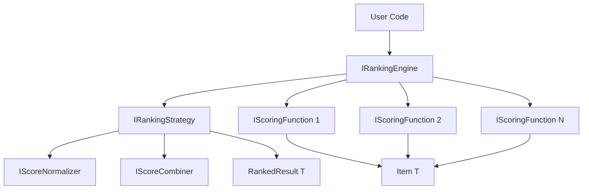

# Ranking API Architecture Specification

## Executive Summary

This document specifies the architecture for a flexible, extensible ranking API that combines multiple scoring functions with weights. The design is inspired by Azure Cosmos DB's hybrid search and Reciprocal Rank Fusion (RRF), but generalized to support arbitrary scoring functions including both similarity and dissimilarity criteria.

## Core Design Principles

1. **Genericity**: Work with any type `T` and any scoring function
2. **Composability**: Combine multiple scoring functions with weights
3. **Extensibility**: Support future ranking strategies through interfaces
4. **Performance**: Efficient computation with minimal allocations
5. **Flexibility**: Support similarity, dissimilarity, and custom scoring

## Architecture Overview



## Core Interfaces

### 1. IScoringFunction<T>

```csharp
namespace AiGeekSquad.AIContext.Ranking
{
    /// <summary>
    /// Represents a function that scores items of type T.
    /// </summary>
    public interface IScoringFunction<T>
    {
        /// <summary>
        /// Gets the name of this scoring function for debugging/logging.
        /// </summary>
        string Name { get; }
        
        /// <summary>
        /// Computes a score for the given item.
        /// </summary>
        /// <param name="item">The item to score.</param>
        /// <returns>A numeric score. Higher values indicate better matches.</returns>
        double ComputeScore(T item);
        
        /// <summary>
        /// Computes scores for multiple items in batch for efficiency.
        /// </summary>
        /// <param name="items">The items to score.</param>
        /// <returns>Array of scores corresponding to input items.</returns>
        double[] ComputeScores(IReadOnlyList<T> items);
    }
}
```

### 2. Weighted Scoring Function

```csharp
namespace AiGeekSquad.AIContext.Ranking
{
    /// <summary>
    /// Represents a scoring function with an associated weight.
    /// </summary>
    public class WeightedScoringFunction<T>
    {
        /// <summary>
        /// The scoring function.
        /// </summary>
        public IScoringFunction<T> Function { get; }
        
        /// <summary>
        /// The weight to apply to this function's scores.
        /// Positive weights increase ranking, negative weights decrease ranking.
        /// </summary>
        public double Weight { get; }
        
        /// <summary>
        /// Optional normalization strategy for this function's scores.
        /// If null, uses the engine's default normalizer.
        /// </summary>
        public IScoreNormalizer Normalizer { get; set; }
        
        public WeightedScoringFunction(IScoringFunction<T> function, double weight)
        {
            Function = function ?? throw new ArgumentNullException(nameof(function));
            Weight = weight;
        }
    }
}
```

### 3. IRankingEngine<T>

```csharp
namespace AiGeekSquad.AIContext.Ranking
{
    /// <summary>
    /// Main interface for ranking items using multiple weighted scoring functions.
    /// </summary>
    public interface IRankingEngine<T>
    {
        /// <summary>
        /// Ranks items using the specified scoring functions and strategy.
        /// </summary>
        /// <param name="items">The items to rank.</param>
        /// <param name="scoringFunctions">The weighted scoring functions to apply.</param>
        /// <param name="strategy">Optional ranking strategy. If null, uses default.</param>
        /// <returns>Ranked results with scores.</returns>
        IList<RankedResult<T>> Rank(
            IReadOnlyList<T> items,
            IReadOnlyList<WeightedScoringFunction<T>> scoringFunctions,
            IRankingStrategy strategy = null);
        
        /// <summary>
        /// Ranks items and returns only the top K results.
        /// </summary>
        IList<RankedResult<T>> RankTopK(
            IReadOnlyList<T> items,
            IReadOnlyList<WeightedScoringFunction<T>> scoringFunctions,
            int k,
            IRankingStrategy strategy = null);
    }
}
```

### 4. IRankingStrategy

```csharp
namespace AiGeekSquad.AIContext.Ranking
{
    /// <summary>
    /// Defines a strategy for combining scores from multiple functions.
    /// </summary>
    public interface IRankingStrategy
    {
        /// <summary>
        /// Gets the name of this strategy.
        /// </summary>
        string Name { get; }
        
        /// <summary>
        /// Combines multiple scores into a final ranking score.
        /// </summary>
        /// <param name="scores">The individual scores from each function.</param>
        /// <param name="weights">The weights for each score.</param>
        /// <param name="context">Additional context for ranking.</param>
        /// <returns>The combined score.</returns>
        double CombineScores(
            IReadOnlyList<double> scores,
            IReadOnlyList<double> weights,
            RankingContext context = null);
    }
}
```

### 5. IScoreNormalizer

```csharp
namespace AiGeekSquad.AIContext.Ranking
{
    /// <summary>
    /// Normalizes scores to a common scale.
    /// </summary>
    public interface IScoreNormalizer
    {
        /// <summary>
        /// Gets the name of this normalization strategy.
        /// </summary>
        string Name { get; }
        
        /// <summary>
        /// Normalizes an array of scores.
        /// </summary>
        /// <param name="scores">The scores to normalize.</param>
        /// <returns>Normalized scores.</returns>
        double[] Normalize(double[] scores);
    }
}
```

## Data Structures

### 1. RankedResult<T>

```csharp
namespace AiGeekSquad.AIContext.Ranking
{
    /// <summary>
    /// Represents a ranked item with its scores.
    /// </summary>
    public class RankedResult<T>
    {
        /// <summary>
        /// The original item.
        /// </summary>
        public T Item { get; }
        
        /// <summary>
        /// The final combined score used for ranking.
        /// </summary>
        public double FinalScore { get; }
        
        /// <summary>
        /// Individual scores from each scoring function.
        /// Key is the function name, value is the normalized score.
        /// </summary>
        public IReadOnlyDictionary<string, double> IndividualScores { get; }
        
        /// <summary>
        /// The rank position (1-based).
        /// </summary>
        public int Rank { get; set; }
        
        /// <summary>
        /// Additional metadata about the ranking.
        /// </summary>
        public Dictionary<string, object> Metadata { get; }
        
        public RankedResult(
            T item,
            double finalScore,
            Dictionary<string, double> individualScores)
        {
            Item = item;
            FinalScore = finalScore;
            IndividualScores = individualScores;
            Metadata = new Dictionary<string, object>();
        }
    }
}
```

### 2. RankingContext

```csharp
namespace AiGeekSquad.AIContext.Ranking
{
    /// <summary>
    /// Provides context for ranking operations.
    /// </summary>
    public class RankingContext
    {
        /// <summary>
        /// Total number of items being ranked.
        /// </summary>
        public int TotalItems { get; set; }
        
        /// <summary>
        /// Current item index being processed.
        /// </summary>
        public int CurrentIndex { get; set; }
        
        /// <summary>
        /// Additional parameters for the ranking strategy.
        /// </summary>
        public Dictionary<string, object> Parameters { get; }
        
        public RankingContext()
        {
            Parameters = new Dictionary<string, object>();
        }
    }
}
```

## Concrete Implementations

### 1. Score Normalization Strategies

```csharp
namespace AiGeekSquad.AIContext.Ranking.Normalizers
{
    /// <summary>
    /// Min-Max normalization to [0, 1] range.
    /// </summary>
    public class MinMaxNormalizer : IScoreNormalizer
    {
        public string Name => "MinMax";
        
        public double[] Normalize(double[] scores)
        {
            if (scores.Length == 0) return scores;
            
            var min = scores.Min();
            var max = scores.Max();
            var range = max - min;
            
            if (range == 0) return scores.Select(_ => 0.5).ToArray();
            
            return scores.Select(s => (s - min) / range).ToArray();
        }
    }
    
    /// <summary>
    /// Z-score normalization (standardization).
    /// </summary>
    public class ZScoreNormalizer : IScoreNormalizer
    {
        public string Name => "ZScore";
        
        public double[] Normalize(double[] scores)
        {
            if (scores.Length == 0) return scores;
            
            var mean = scores.Average();
            var stdDev = Math.Sqrt(scores.Select(s => Math.Pow(s - mean, 2)).Average());
            
            if (stdDev == 0) return scores.Select(_ => 0.0).ToArray();
            
            return scores.Select(s => (s - mean) / stdDev).ToArray();
        }
    }
    
    /// <summary>
    /// Percentile rank normalization.
    /// </summary>
    public class PercentileNormalizer : IScoreNormalizer
    {
        public string Name => "Percentile";
        
        public double[] Normalize(double[] scores)
        {
            if (scores.Length == 0) return scores;
            
            var sorted = scores.OrderBy(s => s).ToArray();
            var result = new double[scores.Length];
            
            for (int i = 0; i < scores.Length; i++)
            {
                var rank = Array.BinarySearch(sorted, scores[i]);
                result[i] = (double)rank / (scores.Length - 1);
            }
            
            return result;
        }
    }
}
```

### 2. Ranking Strategies

```csharp
namespace AiGeekSquad.AIContext.Ranking.Strategies
{
    /// <summary>
    /// Simple weighted sum combination.
    /// </summary>
    public class WeightedSumStrategy : IRankingStrategy
    {
        public string Name => "WeightedSum";
        
        public double CombineScores(
            IReadOnlyList<double> scores,
            IReadOnlyList<double> weights,
            RankingContext context = null)
        {
            if (scores.Count != weights.Count)
                throw new ArgumentException("Scores and weights must have same count");
            
            double sum = 0;
            for (int i = 0; i < scores.Count; i++)
            {
                sum += scores[i] * weights[i];
            }
            
            return sum;
        }
    }
    
    /// <summary>
    /// Reciprocal Rank Fusion strategy.
    /// </summary>
    public class ReciprocalRankFusionStrategy : IRankingStrategy
    {
        public string Name => "RRF";
        
        private readonly double _k;
        
        public ReciprocalRankFusionStrategy(double k = 60)
        {
            _k = k;
        }
        
        public double CombineScores(
            IReadOnlyList<double> scores,
            IReadOnlyList<double> weights,
            RankingContext context = null)
        {
            // RRF requires rank positions, not raw scores
            // This would be computed at the engine level
            // Here we simulate with score-based ranking
            
            double rrfScore = 0;
            for (int i = 0; i < scores.Count; i++)
            {
                // Convert score to pseudo-rank (higher score = lower rank)
                var rank = context.TotalItems - (int)(scores[i] * context.TotalItems);
                rrfScore += weights[i] / (_k + rank);
            }
            
            return rrfScore;
        }
    }
    
    /// <summary>
    /// Hybrid strategy that combines weighted sum with RRF.
    /// </summary>
    public class HybridStrategy : IRankingStrategy
    {
        public string Name => "Hybrid";
        
        private readonly double _alpha; // Weight for weighted sum vs RRF
        private readonly WeightedSumStrategy _weightedSum;
        private readonly ReciprocalRankFusionStrategy _rrf;
        
        public HybridStrategy(double alpha = 0.5, double rrfK = 60)
        {
            _alpha = alpha;
            _weightedSum = new WeightedSumStrategy();
            _rrf = new ReciprocalRankFusionStrategy(rrfK);
        }
        
        public double CombineScores(
            IReadOnlyList<double> scores,
            IReadOnlyList<double> weights,
            RankingContext context = null)
        {
            var wsScore = _weightedSum.CombineScores(scores, weights, context);
            var rrfScore = _rrf.CombineScores(scores, weights, context);
            
            return _alpha * wsScore + (1 - _alpha) * rrfScore;
        }
    }
}
```

### 3. Main Ranking Engine

```csharp
namespace AiGeekSquad.AIContext.Ranking
{
    /// <summary>
    /// Default implementation of the ranking engine.
    /// </summary>
    public class RankingEngine<T> : IRankingEngine<T>
    {
        private readonly IScoreNormalizer _defaultNormalizer;
        private readonly IRankingStrategy _defaultStrategy;
        
        public RankingEngine(
            IScoreNormalizer defaultNormalizer = null,
            IRankingStrategy defaultStrategy = null)
        {
            _defaultNormalizer = defaultNormalizer ?? new MinMaxNormalizer();
            _defaultStrategy = defaultStrategy ?? new WeightedSumStrategy();
        }
        
        public IList<RankedResult<T>> Rank(
            IReadOnlyList<T> items,
            IReadOnlyList<WeightedScoringFunction<T>> scoringFunctions,
            IRankingStrategy strategy = null)
        {
            if (items == null || items.Count == 0)
                return new List<RankedResult<T>>();
            
            if (scoringFunctions == null || scoringFunctions.Count == 0)
                throw new ArgumentException("At least one scoring function is required");
            
            strategy = strategy ?? _defaultStrategy;
            
            // Compute all scores
            var scoreMatrix = new double[items.Count, scoringFunctions.Count];
            var normalizedScores = new double[items.Count, scoringFunctions.Count];
            
            for (int funcIdx = 0; funcIdx < scoringFunctions.Count; funcIdx++)
            {
                var func = scoringFunctions[funcIdx];
                var scores = func.Function.ComputeScores(items);
                
                // Normalize scores
                var normalizer = func.Normalizer ?? _defaultNormalizer;
                var normalized = normalizer.Normalize(scores);
                
                for (int itemIdx = 0; itemIdx < items.Count; itemIdx++)
                {
                    scoreMatrix[itemIdx, funcIdx] = scores[itemIdx];
                    normalizedScores[itemIdx, funcIdx] = normalized[itemIdx];
                }
            }
            
            // Combine scores and create results
            var results = new List<RankedResult<T>>(items.Count);
            var context = new RankingContext { TotalItems = items.Count };
            
            for (int i = 0; i < items.Count; i++)
            {
                context.CurrentIndex = i;
                
                // Extract scores for this item
                var itemScores = new double[scoringFunctions.Count];
                var weights = new double[scoringFunctions.Count];
                var scoreDict = new Dictionary<string, double>();
                
                for (int j = 0; j < scoringFunctions.Count; j++)
                {
                    itemScores[j] = normalizedScores[i, j];
                    weights[j] = scoringFunctions[j].Weight;
                    scoreDict[scoringFunctions[j].Function.Name] = scoreMatrix[i, j];
                }
                
                var finalScore = strategy.CombineScores(itemScores, weights, context);
                
                results.Add(new RankedResult<T>(
                    items[i],
                    finalScore,
                    scoreDict));
            }
            
            // Sort by final score (descending) and assign ranks
            results = results.OrderByDescending(r => r.FinalScore).ToList();
            for (int i = 0; i < results.Count; i++)
            {
                results[i].Rank = i + 1;
            }
            
            return results;
        }
        
        public IList<RankedResult<T>> RankTopK(
            IReadOnlyList<T> items,
            IReadOnlyList<WeightedScoringFunction<T>> scoringFunctions,
            int k,
            IRankingStrategy strategy = null)
        {
            var allResults = Rank(items, scoringFunctions, strategy);
            return allResults.Take(Math.Min(k, allResults.Count)).ToList();
        }
    }
}
```

## Example Usage Scenarios

### Scenario 1: Similarity and Dissimilarity Combined

```csharp
// Define a document class
public class Document
{
    public string Id { get; set; }
    public string Content { get; set; }
    public Vector<double> Embedding { get; set; }
}

// Create scoring functions
public class SimilarityScorer : IScoringFunction<Document>
{
    private readonly Vector<double> _target;
    
    public string Name => $"Similarity to {_targetId}";
    private readonly string _targetId;
    
    public SimilarityScorer(Vector<double> target, string targetId)
    {
        _target = target;
        _targetId = targetId;
    }
    
    public double ComputeScore(Document item)
    {
        // Cosine similarity
        return 1.0 - Distance.Cosine(item.Embedding.ToArray(), _target.ToArray());
    }
    
    public double[] ComputeScores(IReadOnlyList<Document> items)
    {
        return items.Select(ComputeScore).ToArray();
    }
}

// Usage
var documents = LoadDocuments();
var docA = documents.First(d => d.Id == "A");
var docB = documents.First(d => d.Id == "B");

var scoringFunctions = new List<WeightedScoringFunction<Document>>
{
    // Similar to A (positive weight)
    new WeightedScoringFunction<Document>(
        new SimilarityScorer(docA.Embedding, "A"),
        weight: 1.0),
    
    // Dissimilar to B (negative weight for dissimilarity)
    new WeightedScoringFunction<Document>(
        new SimilarityScorer(docB.Embedding, "B"),
        weight: -0.5)
};

var engine = new RankingEngine<Document>();
var results = engine.RankTopK(documents, scoringFunctions, k: 10);

foreach (var result in results)
{
    Console.WriteLine($"Rank {result.Rank}: Doc {result.Item.Id}");
    Console.WriteLine($"  Final Score: {result.FinalScore:F3}");
    Console.WriteLine($"  Similarity to A: {result.IndividualScores["Similarity to A"]:F3}");
    Console.WriteLine($"  Similarity to B: {result.IndividualScores["Similarity to B"]:F3}");
}
```

### Scenario 2: Multi-Modal Search with RRF

```csharp
public class Product
{
    public string Id { get; set; }
    public string Name { get; set; }
    public string Description { get; set; }
    public Vector<double> TextEmbedding { get; set; }
    public Vector<double> ImageEmbedding { get; set; }
    public double Price { get; set; }
    public double Rating { get; set; }
}

// Text similarity scorer
public class TextSearchScorer : IScoringFunction<Product>
{
    private readonly Vector<double> _queryEmbedding;
    public string Name => "Text Search";
    
    public TextSearchScorer(string query)
    {
        _queryEmbedding = GetTextEmbedding(query);
    }
    
    public double ComputeScore(Product item)
    {
        return 1.0 - Distance.Cosine(
            item.TextEmbedding.ToArray(),
            _queryEmbedding.ToArray());
    }
    
    public double[] ComputeScores(IReadOnlyList<Product> items)
    {
        return items.Select(ComputeScore).ToArray();
    }
}

// Image similarity scorer
public class ImageSearchScorer : IScoringFunction<Product>
{
    private readonly Vector<double> _imageEmbedding;
    public string Name => "Image Search";
    
    public ImageSearchScorer(byte[] imageData)
    {
        _imageEmbedding = GetImageEmbedding(imageData);
    }
    
    public double ComputeScore(Product item)
    {
        return 1.0 - Distance.Cosine(
            item.ImageEmbedding.ToArray(),
            _imageEmbedding.ToArray());
    }
    
    public double[] ComputeScores(IReadOnlyList<Product> items)
    {
        return items.Select(ComputeScore).ToArray();
    }
}

// Price scorer (lower price = higher score)
public class PriceScorer : IScoringFunction<Product>
{
    public string Name => "Price";
    private readonly double _maxPrice;
    
    public PriceScorer(double maxPrice)
    {
        _maxPrice = maxPrice;
    }
    
    public double ComputeScore(Product item)
    {
        return 1.0 - (item.Price / _maxPrice);
    }
    
    public double[] ComputeScores(IReadOnlyList<Product> items)
    {
        return items.Select(ComputeScore).ToArray();
    }
}

// Usage with RRF
var products = LoadProducts();

var scoringFunctions = new List<WeightedScoringFunction<Product>>
{
    new WeightedScoringFunction<Product>(
        new TextSearchScorer("red shoes"),
        weight: 1.0),
    
    new WeightedScoringFunction<Product>(
        new ImageSearchScorer(userUploadedImage),
        weight: 0.8),
    
    new WeightedScoringFunction<Product>(
        new PriceScorer(maxPrice: 200),
        weight: 0.3)
};

// Use RRF strategy for combining multiple modalities
var engine = new RankingEngine<Product>(
    defaultStrategy: new ReciprocalRankFusionStrategy(k: 60));

var results = engine.RankTopK(products, scoringFunctions, k: 20);
```

### Scenario 3: Custom Scoring with Business Logic

```csharp
public class CustomerSegmentScorer : IScoringFunction<Product>
{
    private readonly CustomerProfile _profile;
    public string Name => "Customer Segment Match";
    
    public CustomerSegmentScorer(CustomerProfile profile)
    {
        _profile = profile;
    }
    
    public double ComputeScore(Product item)
    {
        var score = 0.0;
        
        // Brand affinity
        if (_profile.PreferredBrands.Contains(item.Brand))
            score += 0.3;
        
        // Price range match
        if (item.Price >= _profile.MinPrice && item.Price <= _profile.MaxPrice)
            score += 0.3;
        
        // Category preference
        if (_profile.PreferredCategories.Contains(item.Category))
            score += 0.4;
        
        return score;
    }
    
    public double[] ComputeScores(IReadOnlyList<Product> items)
    {
        return items.Select(ComputeScore).ToArray();
    }
}

// Combine with other scoring functions
var scoringFunctions = new List<WeightedScoringFunction<Product>>
{
    new WeightedScoringFunction<Product>(
        new TextSearchScorer(searchQuery),
        weight: 0.5),
    
    new WeightedScoringFunction<Product>(
        new CustomerSegmentScorer(currentUser.Profile),
        weight: 0.3),
    
    new WeightedScoringFunction<Product>(
        new PopularityScorer(salesData),
        weight: 0.2)
};
```

## Extensibility Points

### 1. Custom Scoring Functions

Implement `IScoringFunction<T>` to create any custom scoring logic:

```csharp
public class MyCustomScorer : IScoringFunction<MyItem>
{
    public string Name => "Custom Logic";
    
    public double ComputeScore(MyItem item)
    {
        // Any custom logic here
        return customScore;
    }
    
    public double[] ComputeScores(IReadOnlyList<MyItem> items)
    {
        // Batch computation for efficiency
        return items.Select(ComputeScore).ToArray();
    }
}
```

### 2. Custom Normalization

Implement `IScoreNormalizer` for custom normalization:

```csharp
public class LogNormalizer : IScoreNormalizer
{
    public string Name => "Logarithmic";
    
    public double[] Normalize(double[] scores)
    {
        return scores.Select(s => Math.Log(1 + s)).ToArray();
    }
}
```

### 3. Custom Ranking Strategies

Implement `IRankingStrategy` for custom combination logic:

```csharp
public class MachineLearningStrategy : IRankingStrategy
{
    private readonly IMLModel _model;
    public string Name => "ML-Based";
    
    public double CombineScores(
        IReadOnlyList<double> scores,
        IReadOnlyList<double> weights,
        RankingContext context = null)
    {
        // Use ML model to combine scores
        var features = PrepareFeatures(scores, weights, context);
        return _model.Predict(features);
    }
}
```

### 4. Async Support

For I/O-bound scoring functions:

```csharp
public interface IAsyncScoringFunction<T>
{
    Task<double> ComputeScoreAsync(T item);
    Task<double[]> ComputeScoresAsync(IReadOnlyList<T> items);
}

public interface IAsyncRankingEngine<T>
{
    Task<IList<RankedResult<T>>> RankAsync(
        IReadOnlyList<T> items,
        IReadOnlyList<WeightedScoringFunction<T>> scoringFunctions,
        IRankingStrategy strategy = null);
}
```

## Performance Considerations

1. **Batch Scoring**: Always implement `ComputeScores` for batch operations
2. **Caching**: Cache embeddings and scores when possible
3. **Parallelization**: Score computation can be parallelized across functions
4. **Memory**: Pre-allocate arrays for large datasets
5. **Top-K Optimization**: Use heap-based selection for large datasets when only top-K needed

## Testing Strategy

1. **Unit Tests**: Test each component in isolation
2. **Integration Tests**: Test complete ranking scenarios
3. **Benchmark Tests**: Performance testing with various data sizes
4. **Property-Based Tests**: Ensure ranking invariants hold

## Migration Path from Existing MMR

The existing `MaximumMarginalRelevance` class can be wrapped as a strategy:

```csharp
public class MMRStrategy : IRankingStrategy
{
    private readonly double _lambda;
    
    public MMRStrategy(double lambda)
    {
        _lambda = lambda;
    }
    
    public double CombineScores(
        IReadOnlyList<double> scores,
        IReadOnlyList<double> weights,
        RankingContext context = null)
    {
        // Adapt existing MMR logic
        // This would require additional context about selected items
        return mmrScore;
    }
}
```

## Conclusion

This architecture provides a flexible, extensible foundation for ranking operations that:

1. Supports arbitrary item types and scoring functions
2. Enables both similarity and dissimilarity ranking
3. Provides multiple combination strategies (weighted sum, RRF, hybrid)
4. Allows for future extensions (ML models, async operations)
5. Maintains backward compatibility with existing MMR implementation
6. Optimizes for performance with batch operations

The design follows SOLID principles and provides clear extension points for future enhancements while maintaining a simple, intuitive API for common use cases.