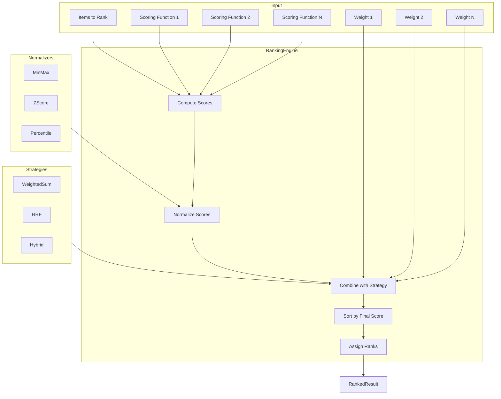

# Ranking API Usage Guide

## Overview

The Ranking Engine is a flexible, extensible API for ranking items of any type `T` using multiple weighted scoring functions. It supports both similarity-based scoring (positive weights) and dissimilarity-based scoring (negative weights), with configurable normalization and combination strategies.

### Key Capabilities

- **Generic Type Support**: Works with any type `T`
- **Multiple Scoring Functions**: Combine unlimited scoring functions with weights
- **Bidirectional Scoring**: Support for both similarity (positive) and dissimilarity (negative) weights
- **Flexible Normalization**: Multiple normalization strategies (MinMax, ZScore, Percentile)
- **Advanced Combination**: Multiple ranking strategies (WeightedSum, RRF, Hybrid)
- **Batch Processing**: Efficient batch scoring for performance
- **Top-K Ranking**: Optimized retrieval of top results

## Core Concepts

### Items
The objects being ranked. Can be any type - documents, products, search results, recommendations, etc.

### Scoring Functions
Functions that evaluate items and produce numeric scores. Higher scores indicate better matches.

### Weights
Multipliers applied to scoring function outputs:
- **Positive weights**: Increase ranking for high scores (similarity)
- **Negative weights**: Decrease ranking for high scores (dissimilarity)

### Normalization
Process of scaling scores to a common range (typically [0,1]) before combining them.

### Combination Strategies
Methods for combining multiple normalized scores into a final ranking score.

## Architecture Flow



## Interfaces and Classes

### IScoringFunction<T>
Defines a function that scores items of type T.

```csharp
public interface IScoringFunction<T>
{
    string Name { get; }
    double ComputeScore(T item);
    double[] ComputeScores(IReadOnlyList<T> items);
}
```

### IRankingEngine<T>
Main interface for ranking items using multiple weighted scoring functions.

```csharp
public interface IRankingEngine<T>
{
    IList<RankedResult<T>> Rank(
        IReadOnlyList<T> items,
        IReadOnlyList<WeightedScoringFunction<T>> scoringFunctions,
        IRankingStrategy? strategy = null);
        
    IList<RankedResult<T>> RankTopK(
        IReadOnlyList<T> items,
        IReadOnlyList<WeightedScoringFunction<T>> scoringFunctions,
        int k,
        IRankingStrategy? strategy = null);
}
```

### WeightedScoringFunction<T>
Combines a scoring function with a weight and optional normalizer.

```csharp
public class WeightedScoringFunction<T>
{
    public IScoringFunction<T> Function { get; }
    public double Weight { get; }
    public IScoreNormalizer? Normalizer { get; set; }
}
```

### RankedResult<T>
Contains ranking results with scores and metadata.

```csharp
public class RankedResult<T>
{
    public T Item { get; }
    public double FinalScore { get; }
    public IReadOnlyDictionary<string, double> IndividualScores { get; }
    public int Rank { get; set; }
    public Dictionary<string, object> Metadata { get; }
}
```

### RankingContext
Provides context information during ranking operations.

```csharp
public class RankingContext
{
    public int TotalItems { get; set; }
    public int CurrentIndex { get; set; }
    public Dictionary<string, object> Parameters { get; }
}
```

## Normalization Strategies

### MinMax Normalization
Scales scores to [0, 1] range using minimum and maximum values.

- **Formula**: `(score - min) / (max - min)`
- **Use case**: When score distributions are relatively uniform
- **Behavior**: Preserves relative distances between scores

### ZScore Normalization
Standardizes scores using mean and standard deviation.

- **Formula**: `(score - mean) / stdDev`
- **Use case**: When dealing with normally distributed scores
- **Behavior**: Centers scores around 0 with unit variance

### Percentile Normalization
Converts scores to percentile ranks.

- **Formula**: Based on score position in sorted array
- **Use case**: When rank order matters more than absolute differences
- **Behavior**: Uniform distribution of normalized scores

## Combination Strategies

### WeightedSum Strategy
Simple linear combination of weighted scores.

- **Formula**: `Σ(score_i × weight_i)`
- **Characteristics**: Fast, intuitive, preserves score magnitudes
- **Best for**: Clear importance hierarchy between scoring functions

### Reciprocal Rank Fusion (RRF)
Combines rankings using reciprocal rank formula.

- **Formula**: `Σ(weight_i / (k + rank_i))`
- **Parameter k**: Controls impact of top-ranked items (default: 60)
- **Characteristics**: Reduces bias from score scale differences
- **Best for**: Combining heterogeneous scoring functions

### Hybrid Strategy
Blends WeightedSum and RRF strategies.

- **Formula**: `α × WeightedSum + (1-α) × RRF`
- **Parameter α**: Balance between strategies (0.0 = pure RRF, 1.0 = pure WeightedSum)
- **Characteristics**: Flexible, adaptable to different scenarios
- **Best for**: Balanced approach with tunable behavior

## Usage Examples

### Basic Weighted Sum Ranking

```csharp
using AiGeekSquad.AIContext.Ranking;
using AiGeekSquad.AIContext.Ranking.Normalizers;

// Define your item type
public class Document
{
    public string Title { get; set; }
    public string Content { get; set; }
    public double RelevanceScore { get; set; }
    public int PopularityRank { get; set; }
}

// Create scoring functions
public class RelevanceScorer : IScoringFunction<Document>
{
    public string Name => "Relevance";
    
    public double ComputeScore(Document doc) => doc.RelevanceScore;
    
    public double[] ComputeScores(IReadOnlyList<Document> docs) =>
        docs.Select(d => d.RelevanceScore).ToArray();
}

public class PopularityScorer : IScoringFunction<Document>
{
    public string Name => "Popularity";
    
    public double ComputeScore(Document doc) => 1.0 / doc.PopularityRank;
    
    public double[] ComputeScores(IReadOnlyList<Document> docs) =>
        docs.Select(d => 1.0 / d.PopularityRank).ToArray();
}

// Use the ranking engine
var engine = new RankingEngine<Document>();
var documents = GetDocuments(); // Your document collection

var scoringFunctions = new[]
{
    new WeightedScoringFunction<Document>(new RelevanceScorer(), 0.7),
    new WeightedScoringFunction<Document>(new PopularityScorer(), 0.3)
};

var results = engine.Rank(documents, scoringFunctions);

// Process results
foreach (var result in results)
{
    Console.WriteLine($"Rank {result.Rank}: {result.Item.Title}");
    Console.WriteLine($"  Final Score: {result.FinalScore:F3}");
    Console.WriteLine($"  Relevance: {result.IndividualScores["Relevance"]:F3}");
    Console.WriteLine($"  Popularity: {result.IndividualScores["Popularity"]:F3}");
}
```

### Similarity + Dissimilarity Ranking

```csharp
// Scoring function for recency (newer is better)
public class RecencyScorer : IScoringFunction<Document>
{
    private readonly DateTime _referenceDate;
    
    public string Name => "Recency";
    
    public RecencyScorer(DateTime referenceDate) => _referenceDate = referenceDate;
    
    public double ComputeScore(Document doc)
    {
        var daysDiff = (_referenceDate - doc.PublishedDate).TotalDays;
        return Math.Max(0, 365 - daysDiff) / 365.0;
    }
    
    public double[] ComputeScores(IReadOnlyList<Document> docs) =>
        docs.Select(ComputeScore).ToArray();
}

// Combine similarity and dissimilarity
var scoringFunctions = new[]
{
    // Positive weight: reward high relevance
    new WeightedScoringFunction<Document>(new RelevanceScorer(), 1.0),
    
    // Negative weight: penalize high popularity rank (lower rank = more popular)
    new WeightedScoringFunction<Document>(new PopularityScorer(), -0.5),
    
    // Positive weight: reward recent documents
    new WeightedScoringFunction<Document>(new RecencyScorer(DateTime.Now), 0.3)
};

var results = engine.Rank(documents, scoringFunctions);
```

### Using Different Normalization Strategies

```csharp
using AiGeekSquad.AIContext.Ranking.Normalizers;

// MinMax normalization (default)
var minMaxEngine = new RankingEngine<Document>(
    defaultNormalizer: new MinMaxNormalizer()
);

// ZScore normalization
var zScoreEngine = new RankingEngine<Document>(
    defaultNormalizer: new ZScoreNormalizer()
);

// Percentile normalization
var percentileEngine = new RankingEngine<Document>(
    defaultNormalizer: new PercentileNormalizer()
);

// Per-function normalization
var scoringFunctions = new[]
{
    new WeightedScoringFunction<Document>(new RelevanceScorer(), 0.7)
    {
        Normalizer = new MinMaxNormalizer() // Use MinMax for relevance
    },
    new WeightedScoringFunction<Document>(new PopularityScorer(), 0.3)
    {
        Normalizer = new ZScoreNormalizer() // Use ZScore for popularity
    }
};

var results = engine.Rank(documents, scoringFunctions);
```

### Using RRF and Hybrid Strategies

```csharp
using AiGeekSquad.AIContext.Ranking.Strategies;

// Reciprocal Rank Fusion
var rrfStrategy = new ReciprocalRankFusionStrategy(k: 60);
var rrfEngine = new RankingEngine<Document>(defaultStrategy: rrfStrategy);

var rrfResults = rrfEngine.Rank(documents, scoringFunctions);

// Hybrid strategy (70% WeightedSum, 30% RRF)
var hybridStrategy = new HybridStrategy(alpha: 0.7, rrfK: 60);
var hybridEngine = new RankingEngine<Document>(defaultStrategy: hybridStrategy);

var hybridResults = hybridEngine.Rank(documents, scoringFunctions);

// Pass strategy per ranking call
var customResults = engine.Rank(documents, scoringFunctions, 
    strategy: new ReciprocalRankFusionStrategy(k: 100));
```

### Top-K Ranking

```csharp
// Get only top 10 results
var top10Results = engine.RankTopK(documents, scoringFunctions, k: 10);

// With custom strategy
var top5RRF = engine.RankTopK(
    documents, 
    scoringFunctions, 
    k: 5,
    strategy: new ReciprocalRankFusionStrategy(k: 30)
);
```

## Extensibility

### Creating Custom Scoring Functions

```csharp
public class CustomScorer : IScoringFunction<MyItem>
{
    private readonly IExternalService _service;
    
    public string Name => "CustomScore";
    
    public CustomScorer(IExternalService service) => _service = service;
    
    public double ComputeScore(MyItem item)
    {
        // Custom scoring logic
        var features = ExtractFeatures(item);
        return _service.CalculateScore(features);
    }
    
    public double[] ComputeScores(IReadOnlyList<MyItem> items)
    {
        // Batch scoring for efficiency
        return _service.CalculateScoresBatch(items);
    }
}
```

### Creating Custom Normalizers

```csharp
public class LogNormalizer : IScoreNormalizer
{
    public string Name => "Logarithmic";
    
    public double[] Normalize(double[] scores)
    {
        if (scores == null || scores.Length == 0) return scores;
        
        // Apply logarithmic scaling
        var minScore = scores.Where(s => s > 0).DefaultIfEmpty(1).Min();
        return scores.Select(s => s > 0 ? Math.Log(s / minScore + 1) : 0).ToArray();
    }
}
```

### Creating Custom Ranking Strategies

```csharp
public class CustomStrategy : IRankingStrategy
{
    public string Name => "Custom";
    
    public double CombineScores(
        IReadOnlyList<double> scores,
        IReadOnlyList<double> weights,
        RankingContext? context = null)
    {
        // Custom combination logic
        double result = 0;
        for (int i = 0; i < scores.Count; i++)
        {
            // Example: Apply exponential weighting
            result += Math.Pow(scores[i], weights[i]);
        }
        return result;
    }
}
```

## Performance Considerations

### Benchmark Results

Based on comprehensive benchmarks using BenchmarkDotNet v0.15.2 on .NET 9.0 with 306 total benchmark configurations:

#### Ranking Engine Performance by Dataset Size

**Small Dataset (100 items)**:
- **Single Function Baseline**: ~16-25 μs mean execution time
- **Multiple Functions (3-5)**: ~40-60 μs with normalization
- **Complex Scoring**: ~17-20 μs for simple complexity
- **Memory Usage**: ~2.3-2.4 KB allocated per operation

**Medium Dataset (10,000 items)**:
- **Single Function**: ~200-250 μs mean execution time
- **Multiple Functions**: ~450-550 μs with weighted combination
- **Normalization Overhead**:
  - MinMax: ~460-500 μs
  - ZScore: ~590-670 μs
  - Percentile: ~1.1-1.3 ms
- **Memory Usage**: ~4.5-5.2 KB allocated per operation

**Large Dataset (100,000 items)**:
- **Single Function**: ~1.3-1.4 ms mean execution time
- **Multiple Functions**: ~3.1-3.8 ms with complex strategies
- **Strategy Performance**:
  - WeightedSum: ~3.2-3.3 ms
  - RRF: ~3.2-3.7 ms
  - Hybrid: ~3.5-4.2 ms
- **Memory Usage**: Consistent allocation patterns across sizes

#### Performance by Ranking Strategy

**WeightedSum Strategy**:
- **Fastest combination method** for most scenarios
- **Linear scaling** with number of scoring functions
- **Minimal overhead** beyond individual function costs

**Reciprocal Rank Fusion (RRF)**:
- **Comparable performance** to WeightedSum for most datasets
- **Better handling** of score scale differences
- **Slight overhead** for rank calculation

**Hybrid Strategy**:
- **10-20% slower** than pure strategies
- **Most flexible** for complex ranking scenarios
- **Tunable performance** via alpha parameter

#### GC and Memory Performance

**Garbage Collection Impact**:
- **Server GC**: Better performance for datasets >1,000 items
- **Workstation GC**: Adequate for smaller datasets
- **Generation 0/1/2 Collections**: Minimal across all configurations

**Memory Allocation Patterns**:
- **Predictable scaling** with dataset size
- **Efficient normalization** with minimal temporary allocations
- **Cache-friendly** access patterns for large datasets

### Batch Scoring
Always implement `ComputeScores` for batch processing:

```csharp
public double[] ComputeScores(IReadOnlyList<T> items)
{
    // Process all items at once for better performance
    return BatchProcess(items);
}
```

### Caching
Consider caching scores for expensive computations:

```csharp
public class CachedScorer<T> : IScoringFunction<T>
{
    private readonly IScoringFunction<T> _innerScorer;
    private readonly IMemoryCache _cache;
    
    public double ComputeScore(T item)
    {
        var key = GetCacheKey(item);
        return _cache.GetOrCreate(key, entry =>
        {
            entry.SlidingExpiration = TimeSpan.FromMinutes(5);
            return _innerScorer.ComputeScore(item);
        });
    }
}
```

### Efficiency Tips

1. **Use Top-K when possible**: `RankTopK` shows similar performance to full ranking
2. **Batch operations**: Process items in batches rather than individually
3. **Choose appropriate normalization**:
   - MinMax: Fastest for uniform distributions
   - ZScore: Good for normal distributions (20-40% slower)
   - Percentile: Most expensive but rank-preserving (2-3x slower)
4. **Strategy selection**:
   - WeightedSum: Best performance for clear importance hierarchy
   - RRF: Minimal overhead for heterogeneous scoring functions
   - Hybrid: Use when flexibility outweighs performance cost
5. **Parallel processing**: For large datasets, consider parallel scoring:

```csharp
public double[] ComputeScores(IReadOnlyList<T> items)
{
    var scores = new double[items.Count];
    Parallel.For(0, items.Count, i =>
    {
        scores[i] = ComputeScore(items[i]);
    });
    return scores;
}
```

### Performance Recommendations by Use Case

| Dataset Size | Recommended Strategy | Expected Performance | Memory Usage |
|-------------|---------------------|---------------------|--------------|
| < 1,000 items | Any strategy | < 100 μs | < 5 KB |
| 1,000-10,000 items | WeightedSum/RRF | 200-600 μs | 5-10 KB |
| 10,000-100,000 items | WeightedSum preferred | 1-4 ms | 10-20 KB |
| > 100,000 items | Consider pre-filtering | > 4 ms | > 20 KB |

## Best Practices

1. **Choose appropriate weights**: Test different weight combinations for your use case
2. **Normalize consistently**: Use the same normalizer for comparable scoring functions
3. **Monitor performance**: Profile scoring functions for bottlenecks
4. **Handle edge cases**: Account for empty collections and null values
5. **Document scoring logic**: Clearly document what each scoring function measures
6. **Test thoroughly**: Validate ranking results with known test cases
7. **Consider scale**: Different strategies perform better at different scales

## Common Pitfalls

1. **Mixing scales**: Ensure scores are normalized before combining
2. **Weight imbalance**: Very large weight differences can dominate results
3. **Negative weights misuse**: Understand that negative weights invert preferences
4. **Context requirements**: RRF strategy requires RankingContext
5. **Performance degradation**: Avoid redundant computations in scoring functions

## Related Documentation

- [Ranking API Architecture](./RankingAPI_Architecture.md) - Detailed architecture specification
- [Maximum Marginal Relevance](./MMR.md) - MMR implementation for diversity
- [Semantic Chunking](./SemanticChunking.md) - Text chunking for ranking
- [Context Rendering](./ContextRendering.md) - Advanced RAG context management using ranking strategies

## Summary

The Ranking API provides a powerful, flexible system for ranking any type of items using multiple criteria. With support for various normalization and combination strategies, it can be adapted to diverse ranking scenarios from search results to recommendations. The generic design and extensibility points allow for custom implementations while maintaining consistent behavior and performance.